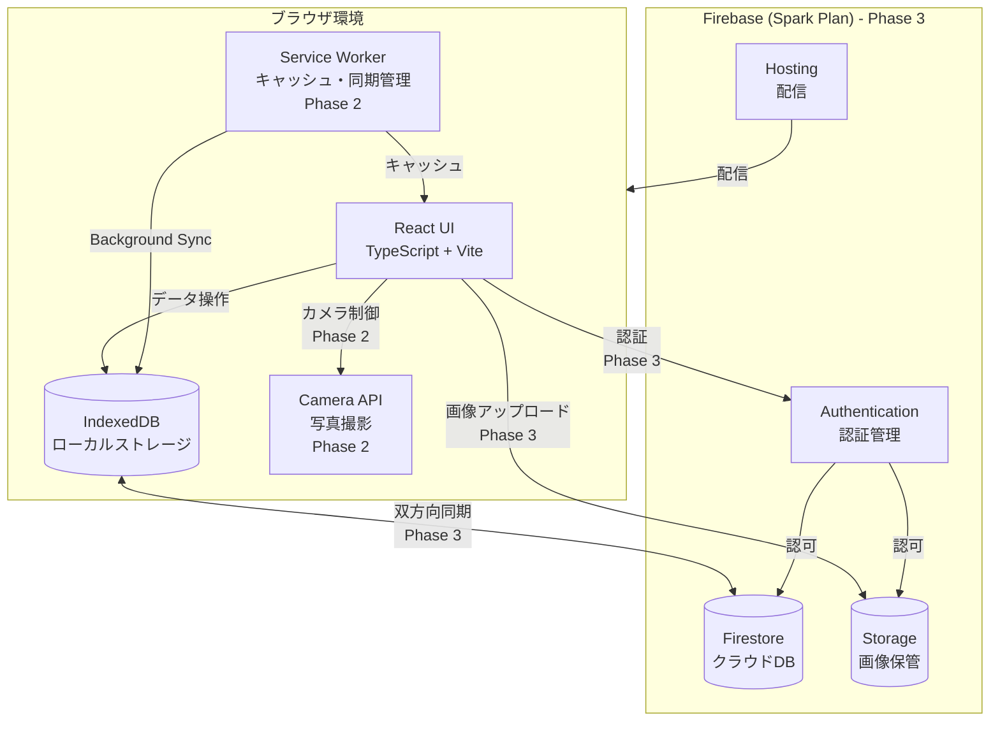
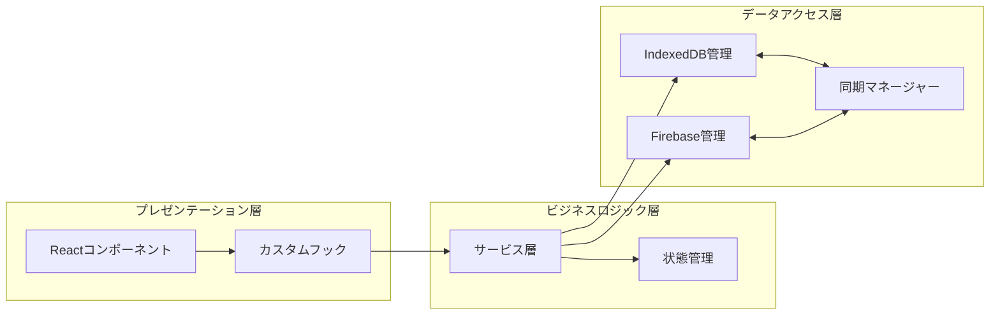
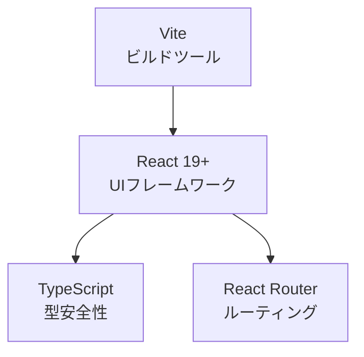
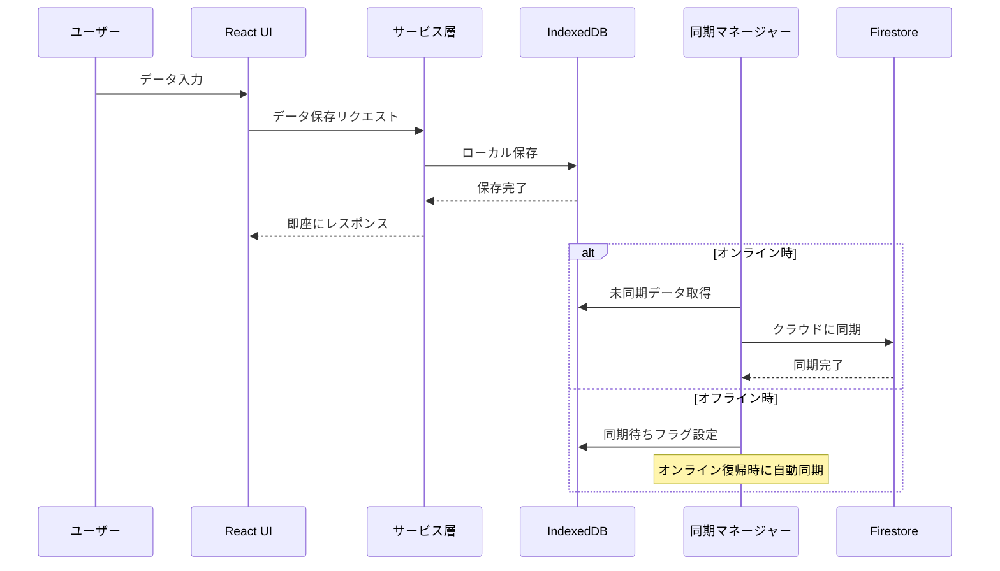
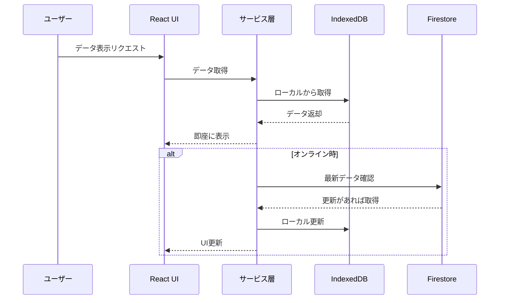
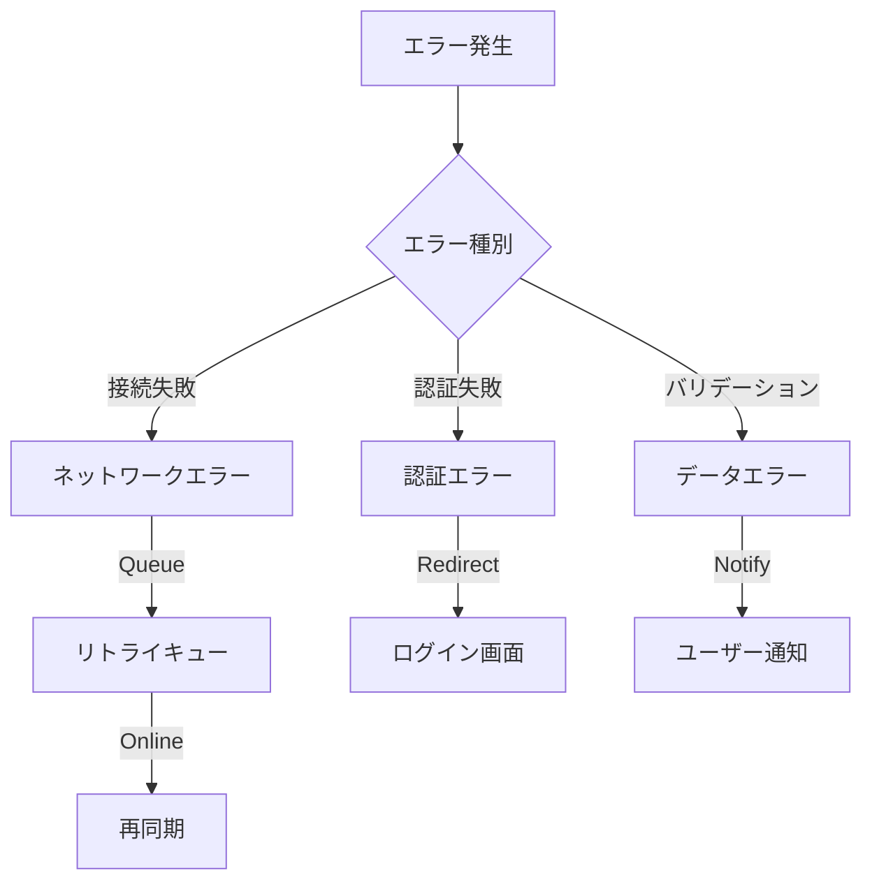

# システムアーキテクチャ設計書

## 1. 全体構成

### 1.1 システム構成図

### 1.2 アーキテクチャパターン

**オフラインファーストアーキテクチャ**を採用:

1. **ローカルファースト**: すべての操作はまずIndexedDBに保存
2. **バックグラウンド同期**: オンライン時にFirestoreと自動同期
3. **キャッシュ優先**: Service Workerによるアプリケーションシェルのキャッシュ

## 2. レイヤー構成

### 2.1 各層の責務

| 層 | 責務 | 主要技術 |
|---|---|---|
| プレゼンテーション層 | UI表示、ユーザー入力処理 | React, TypeScript |
| ビジネスロジック層 | データ処理、バリデーション、状態管理 | React Context/Hooks |
| データアクセス層 | データ永続化、同期処理 | IndexedDB, Firestore |

## 3. 技術スタック詳細

### 3.1 フロントエンド

**主要ライブラリ**:
- **React 19**: UIフレームワーク
- **TypeScript 5.2+**: 型安全な開発
- **Vite 7**: 高速ビルド・開発サーバー
- **React Router 6**: SPAルーティング
- **Chart.js 4**: グラフ表示
- **date-fns 3**: 日付処理

### 3.2 データストレージ

**ローカル (IndexedDB)**:
- 全データのローカルキャッシュ
- オフライン時の読み書き
- ライブラリ: `idb` (Promise-based wrapper)

**クラウド (Firestore)**:
- マルチデバイス同期
- バックアップ
- NoSQLドキュメント指向DB

### 3.3 PWA対応 (Phase 2実装完了)

**Service Worker**:
- アプリケーションシェルのキャッシュ
- オフライン動作
- Background Sync API
- Push Notifications

**Manifest**:
- アプリアイコン、スプラッシュ画面
- インストール可能なPWA

## 4. データフロー

### 4.1 データ書き込みフロー

### 4.2 データ読み込みフロー

## 5. パフォーマンス戦略

### 5.1 最適化手法

| 手法 | 適用箇所 | 効果 |
|---|---|---|
| Code Splitting | ルート単位でのコード分割 | 初期ロード時間短縮 |
| Lazy Loading | 画像・重いコンポーネント | メモリ節約 |
| Service Worker Cache | 静的アセット | オフライン動作 |
| 画像圧縮 | アップロード時 | ストレージ節約 |
| IndexedDB | データキャッシュ | 高速読み込み |

### 5.2 目標指標

- **初回ロード**: < 3秒
- **画面遷移**: < 200ms
- **データ保存**: < 100ms (ローカル)

## 6. エラーハンドリング戦略

**エラー対応方針**:
- **ネットワークエラー**: リトライキューに追加、オンライン復帰時に自動再試行
- **認証エラー**: ログイン画面にリダイレクト、セッション再構築
- **データエラー**: ユーザーフレンドリーなメッセージ表示

## 7. スケーラビリティ考慮

### 7.1 現在の設計
- 個人利用を想定
- Firebase Spark Plan (無料枠)
- 単一ユーザーのマルチデバイス対応

### 7.2 将来の拡張性
- **Phase 5対応**: 複数人での共有機能
- **有料プランへの移行**: Blaze Planへのスムーズな移行パス
- **マイクロサービス化**: 必要に応じて機能を分離可能な設計

