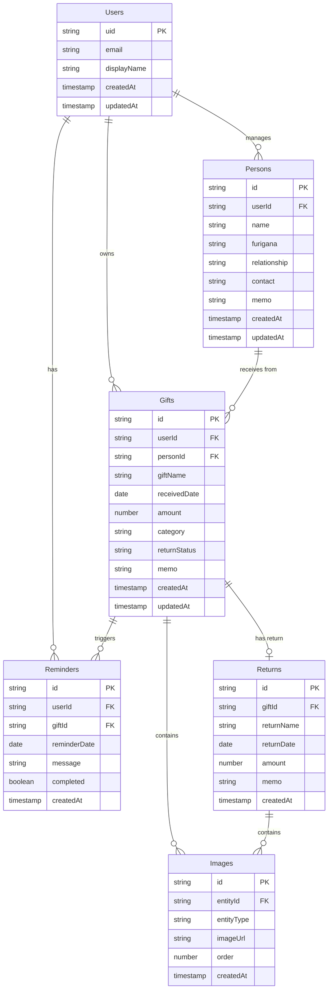
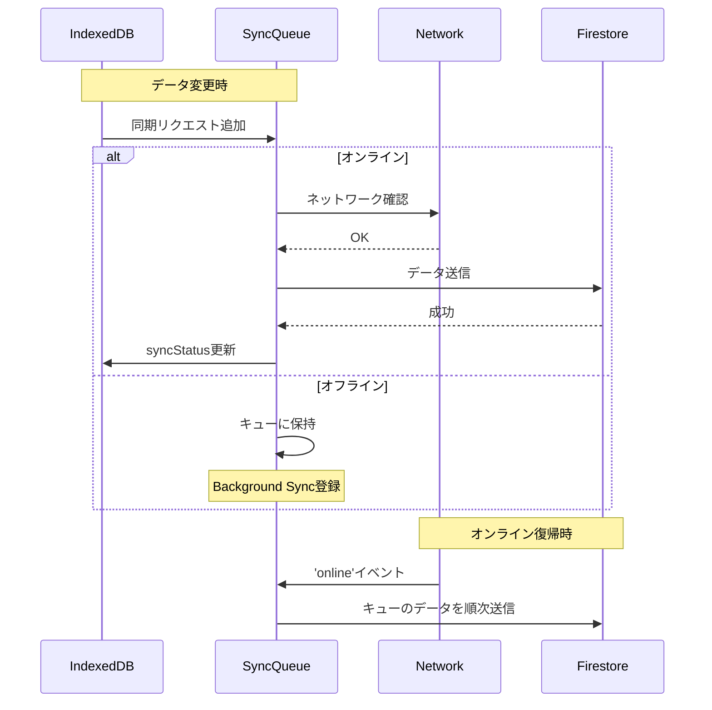

# データベース設計書

## 1. データモデル概要

### 1.1 ER図



## 2. Firestore コレクション設計

### 2.1 コレクション構造

```
/users/{userId}
  - uid: string
  - email: string
  - displayName: string
  - createdAt: timestamp
  - updatedAt: timestamp

/users/{userId}/persons/{personId}
  - name: string
  - furigana: string
  - relationship: string (enum)
  - contact: string (optional)
  - memo: string (optional)
  - createdAt: timestamp
  - updatedAt: timestamp

/users/{userId}/gifts/{giftId}
  - personId: string (reference)
  - giftName: string
  - receivedDate: timestamp
  - amount: number
  - category: string (enum)
  - returnStatus: string (enum: 'pending', 'completed', 'not_required')
  - memo: string (optional)
  - createdAt: timestamp
  - updatedAt: timestamp
  - syncStatus: string (local use)

/users/{userId}/gifts/{giftId}/returns/{returnId}
  - returnName: string
  - returnDate: timestamp
  - amount: number
  - memo: string (optional)
  - createdAt: timestamp

/users/{userId}/reminders/{reminderId}
  - giftId: string (reference)
  - reminderDate: timestamp
  - message: string
  - completed: boolean
  - createdAt: timestamp

/users/{userId}/images/{imageId}
  - entityId: string (reference to gift or return)
  - entityType: string (enum: 'gift', 'return')
  - imageUrl: string
  - order: number
  - createdAt: timestamp
```

### 2.2 インデックス設計

**Firestore複合インデックス**:

1. **gifts** コレクション:
   - `(userId, receivedDate DESC)`
   - `(userId, returnStatus, receivedDate DESC)`
   - `(userId, category, receivedDate DESC)`
   - `(userId, personId, receivedDate DESC)`

2. **reminders** コレクション:
   - `(userId, completed, reminderDate ASC)`

## 3. IndexedDB ストア設計

### 3.1 データベーススキーマ

**データベース名**: `IwailistDB`  
**バージョン**: 1

```javascript
// ストア定義
const stores = {
  users: {
    keyPath: 'uid',
    indexes: []
  },
  persons: {
    keyPath: 'id',
    indexes: [
      { name: 'userId', keyPath: 'userId' },
      { name: 'name', keyPath: 'name' }
    ]
  },
  gifts: {
    keyPath: 'id',
    indexes: [
      { name: 'userId', keyPath: 'userId' },
      { name: 'personId', keyPath: 'personId' },
      { name: 'receivedDate', keyPath: 'receivedDate' },
      { name: 'returnStatus', keyPath: 'returnStatus' },
      { name: 'category', keyPath: 'category' }
    ]
  },
  returns: {
    keyPath: 'id',
    indexes: [
      { name: 'giftId', keyPath: 'giftId' }
    ]
  },
  images: {
    keyPath: 'id',
    indexes: [
      { name: 'entityId', keyPath: 'entityId' },
      { name: 'entityType', keyPath: 'entityType' }
    ]
  },
  reminders: {
    keyPath: 'id',
    indexes: [
      { name: 'userId', keyPath: 'userId' },
      { name: 'giftId', keyPath: 'giftId' },
      { name: 'reminderDate', keyPath: 'reminderDate' }
    ]
  },
  syncQueue: {
    keyPath: 'id',
    indexes: [
      { name: 'status', keyPath: 'status' },
      { name: 'timestamp', keyPath: 'timestamp' }
    ]
  }
};
```

### 3.2 画像データ保存

```javascript
// 画像ストアスキーマ
{
  id: string,           // UUID
  entityId: string,     // giftId or returnId
  entityType: string,   // 'gift' or 'return'
  blob: Blob,          // 画像バイナリデータ
  thumbnail: Blob,     // サムネイル (圧縮版)
  fileName: string,
  mimeType: string,
  size: number,
  order: number,
  uploadedToCloud: boolean,
  cloudUrl: string,    // Firebase Storage URL
  createdAt: timestamp
}
```

## 4. データ同期戦略

### 4.1 同期フロー



### 4.2 競合解決戦略

**Last-Write-Wins (LWW)** 方式を採用:

```javascript
// 競合解決ロジック
function resolveConflict(localData, remoteData) {
  const localTimestamp = localData.updatedAt;
  const remoteTimestamp = remoteData.updatedAt;
  
  if (localTimestamp > remoteTimestamp) {
    // ローカルが新しい: リモートに上書き
    return { winner: 'local', action: 'upload' };
  } else if (remoteTimestamp > localTimestamp) {
    // リモートが新しい: ローカルに上書き
    return { winner: 'remote', action: 'download' };
  } else {
    // 同じタイムスタンプ: 変更なし
    return { winner: 'none', action: 'skip' };
  }
}
```

### 4.3 同期キュー管理

```javascript
// SyncQueueストアのレコード
{
  id: string,
  operation: 'create' | 'update' | 'delete',
  collection: string,      // 'gifts', 'persons', etc.
  documentId: string,
  data: object,           // 同期するデータ
  status: 'pending' | 'processing' | 'completed' | 'failed',
  retryCount: number,
  lastError: string,
  timestamp: timestamp
}
```

## 5. データ制約とバリデーション

### 5.1 フィールド制約

| コレクション | フィールド | 制約 |
|---|---|---|
| persons | name | 必須, 1-100文字 |
| persons | furigana | 任意, 1-100文字 |
| persons | relationship | 必須, enum値 |
| gifts | giftName | 必須, 1-200文字 |
| gifts | amount | 任意, 0以上の数値 |
| gifts | category | 必須, enum値 |
| gifts | returnStatus | 必須, enum値 |
| returns | returnName | 必須, 1-200文字 |
| returns | amount | 任意, 0以上の数値 |

### 5.2 Enum定義

```typescript
// 関係性
enum Relationship {
  FAMILY = '家族',
  RELATIVE = '親戚',
  FRIEND = '友人',
  COLLEAGUE = '会社関係',
  ACQUAINTANCE = '知人',
  OTHER = 'その他'
}

// カテゴリ
enum GiftCategory {
  WEDDING = '結婚祝い',
  BIRTH = '出産祝い',
  HOSPITAL = 'お見舞い',
  CELEBRATION = 'お祝い',
  CONDOLENCE = '香典・お悔やみ',
  SEASONAL = '季節の贈り物',
  OTHER = 'その他'
}

// お返し状況
enum ReturnStatus {
  PENDING = '未対応',
  COMPLETED = '対応済',
  NOT_REQUIRED = '不要'
}
```

## 6. データ容量見積もり

### 6.1 個人利用時の想定

| データ種別 | 件数/年 | サイズ/件 | 年間容量 |
|---|---|---|---|
| 贈答品レコード | 50件 | 1KB | 50KB |
| 人物レコード | 30件 | 0.5KB | 15KB |
| 画像 (圧縮後) | 100枚 | 500KB | 50MB |
| その他メタデータ | - | - | 5MB |
| **合計** | - | - | **約55MB/年** |

### 6.2 Firebase無料枠との比較

- **Firestore**: 1GB → 約18年分の容量
- **Storage**: 5GB → 約90年分の画像
- **読み取り**: 50K/日 → 個人利用では十分

**結論**: 長期的に無料枠内で運用可能

## 7. バックアップ戦略

### 7.1 自動バックアップ
- **Firestore**: 自動でレプリケーション
- **Storage**: 自動で冗長化

### 7.2 データエクスポート機能 (将来実装)
- ユーザーが全データをJSON形式でエクスポート可能
- 画像も含めたZIPダウンロード機能

