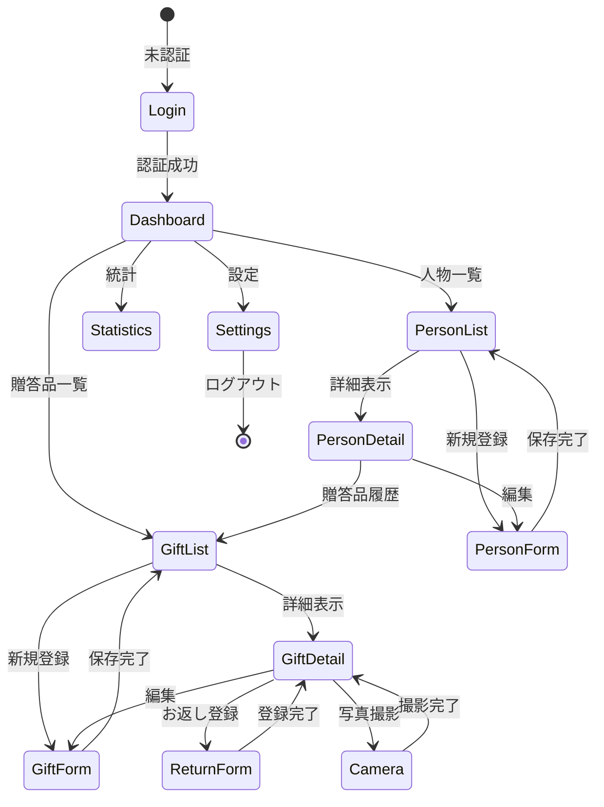
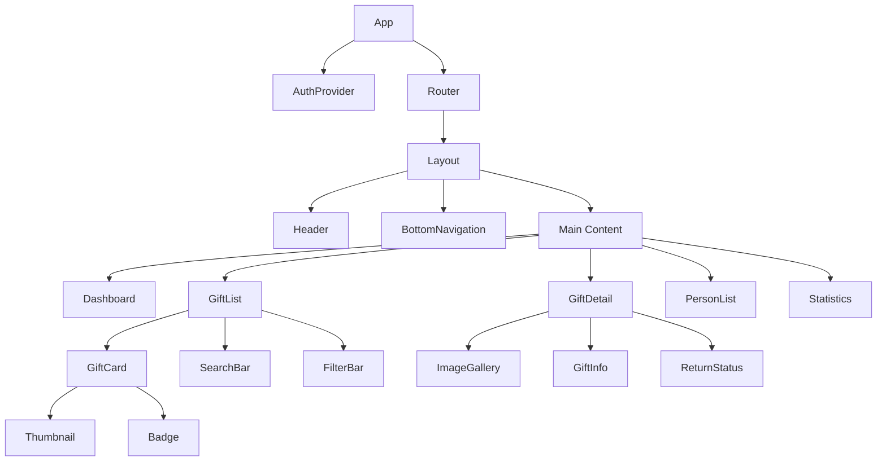

# UI/UX設計書

## 1. 画面遷移設計

### 1.1 画面遷移図



### 1.2 画面一覧

| 画面ID | 画面名 | Phase | 説明 |
|---|---|---|---|
| AUTH-01 | ログイン画面 | Phase 3 | Email/Google認証 |
| DASH-01 | ダッシュボード | Phase 1 | ホーム画面、概要表示 |
| GIFT-01 | 贈答品一覧 | Phase 1 | 一覧・検索・フィルタ |
| GIFT-02 | 贈答品詳細 | Phase 1 | 詳細情報表示 |
| GIFT-03 | 贈答品登録/編集 | Phase 1 | 入力フォーム |
| PERS-01 | 人物一覧 | Phase 1 | 人物リスト |
| PERS-02 | 人物詳細 | Phase 1 | 人物情報・贈答品履歴 |
| PERS-03 | 人物登録/編集 | Phase 1 | 入力フォーム |
| CAME-01 | カメラ撮影 | Phase 1 | 写真撮影画面 |
| STAT-01 | 基本統計 | Phase 1 | ダッシュボード用統計 |
| RETU-01 | お返し一覧 | Phase 4 | お返し必要リスト |
| RETU-02 | お返し登録 | Phase 4 | お返し記録フォーム |
| STAT-02 | 詳細分析 | Phase 4 | グラフ・集計表示 |
| SETT-01 | 設定 | Phase 3 | ユーザー設定 |

## 2. 主要画面設計

### 2.1 ダッシュボード (DASH-01)

**レイアウト**:
```
┌─────────────────────────────────┐
│ ヘッダー                         │
│ [ロゴ] 祝い品管理  [設定][通知]  │
├─────────────────────────────────┤
│ サマリーカード                   │
│ ┌──────┐ ┌──────┐ ┌──────┐   │
│ │未対応 │ │今月  │ │総額  │   │
│ │ 5件  │ │ 3件  │ │ 50万│   │
│ └──────┘ └──────┘ └──────┘   │
├─────────────────────────────────┤
│ クイックアクション               │
│ [+ 贈答品登録] [+ 人物登録]      │
├─────────────────────────────────┤
│ 最近の贈答品                     │
│ ┌────────────────────────┐    │
│ │ 田中様 - 結婚祝い      →│    │
│ │ 2024/10/15  30,000円    │    │
│ └────────────────────────┘    │
│ ┌────────────────────────┐    │
│ │ 佐藤様 - 出産祝い      →│    │
│ │ 2024/10/10  10,000円    │    │
│ └────────────────────────┘    │
├─────────────────────────────────┤
│ ボトムナビゲーション             │
│ [ホーム][贈答品][人物][統計]    │
└─────────────────────────────────┘
```

**主要機能**:
- お返し未対応件数の表示
- 今月受け取った贈答品の件数
- 最近の贈答品5件をリスト表示
- 基本統計（月別受取金額、カテゴリ別内訳）
- クイックアクションボタン

### 2.2 贈答品一覧 (GIFT-01)

**レイアウト**:
```
┌─────────────────────────────────┐
│ 贈答品一覧         [+ 新規登録] │
├─────────────────────────────────┤
│ [検索ボックス]                   │
│ フィルタ: [全て▼][未対応][対応済]│
│ 並び替え: [日付▼]               │
├─────────────────────────────────┤
│ ┌────────────────────────┐    │
│ │ [写真] 田中太郎様      未対応│    │
│ │        結婚祝い              │    │
│ │        2024/10/15  30,000円  │    │
│ └────────────────────────┘    │
│ ┌────────────────────────┐    │
│ │ [写真] 佐藤花子様      対応済│    │
│ │        出産祝い              │    │
│ │        2024/09/20  10,000円  │    │
│ └────────────────────────┘    │
└─────────────────────────────────┘
```

**主要機能**:
- カード表示/リスト表示切り替え
- リアルタイム検索
- フィルタ: カテゴリ、お返し状況、日付範囲
- 並び替え: 日付、金額、贈り主名

### 2.3 贈答品詳細 (GIFT-02)

**レイアウト**:
```
┌─────────────────────────────────┐
│ [←] 贈答品詳細        [編集][削除]│
├─────────────────────────────────┤
│ 写真ギャラリー                   │
│ ┌───────────────────────┐     │
│ │   [メイン画像]        │     │
│ └───────────────────────┘     │
│ [🎥] [サムネイル] [サムネイル]   │
├─────────────────────────────────┤
│ 基本情報                         │
│ 贈答品名: 結婚祝い               │
│ 贈り主: 田中太郎様              │
│ 受け取り日: 2024/10/15           │
│ 金額: 30,000円                  │
│ カテゴリ: 結婚祝い               │
├─────────────────────────────────┤
│ お返し状況: ⚠ 未対応            │
│ [お返しを記録する]              │
├─────────────────────────────────┤
│ メモ                             │
│ 結婚式に参加していただいた...    │
└─────────────────────────────────┘
```

**主要機能**:
- 写真スワイプギャラリー
- 贈り主情報へのリンク
- お返し記録へのクイックアクセス
- 編集・削除アクション

### 2.4 贈答品登録/編集フォーム (GIFT-03)

**レイアウト**:
```
┌─────────────────────────────────┐
│ [×] 贈答品登録                   │
├─────────────────────────────────┤
│ 写真                             │
│ ┌────┐ ┌────┐ [+ 追加]        │
│ │写真1│ │写真2│ (最大5枚)      │
│ └────┘ └────┘                 │
├─────────────────────────────────┤
│ 贈答品名 *                       │
│ [__________________]             │
│                                 │
│ 贈り主 *                         │
│ [選択してください ▼]  [+ 新規]  │
│                                 │
│ 受け取り日 *                     │
│ [2024/10/15     📅]             │
│                                 │
│ 金額                             │
│ [__________________] 円          │
│                                 │
│ カテゴリ *                       │
│ [結婚祝い ▼]                    │
│                                 │
│ お返し状況 *                     │
│ ( ) 未対応 ( ) 対応済 ( ) 不要   │
│                                 │
│ メモ                             │
│ [___________________________]   │
│ [___________________________]   │
├─────────────────────────────────┤
│           [キャンセル] [保存]    │
└─────────────────────────────────┘
```

**バリデーション**:
- 必須項目: 贈答品名、贈り主、受け取り日、カテゴリ、お返し状況
- 金額: 0以上の数値
- 日付: 未来日不可
- 写真: 最大5枚、各10MB以下

### 2.5 カメラ撮影画面 (CAME-01)

**レイアウト**:
```
┌─────────────────────────────────┐
│ [×] 写真を撮影                   │
├─────────────────────────────────┤
│                                 │
│                                 │
│        [カメラプレビュー]        │
│                                 │
│                                 │
│                                 │
├─────────────────────────────────┤
│         [🔄]  [⚪]  [📷]        │
│       カメラ切替 撮影 ギャラリー │
└─────────────────────────────────┘
```

**機能**:
- リアルタイムカメラプレビュー
- フロント/リアカメラ切り替え
- シャッターボタン
- ギャラリーから選択

### 2.6 基本統計画面 (STAT-01)

**レイアウト**:
```
┌─────────────────────────────────┐
│ 基本統計                         │
├─────────────────────────────────┤
│ 期間: [今月 ▼] [2024年10月]    │
├─────────────────────────────────┤
│ 月別受取金額                     │
│ ┌───────────────────────┐     │
│ │   [シンプル棒グラフ]  │     │
│ └───────────────────────┘     │
├─────────────────────────────────┤
│ カテゴリ別内訳                   │
│ ┌───────────────────────┐     │
│ │   [シンプル円グラフ]  │     │
│ └───────────────────────┘     │
├─────────────────────────────────┤
│ お返し状況                       │
│ 対応済: 15件 (75%)              │
│ 未対応:  5件 (25%)              │
│ ┌────────────────────┐        │
│ │████████░░│ 75%            │
│ └────────────────────┘        │
└─────────────────────────────────┘
```

### 2.7 詳細分析画面 (STAT-02) - Phase 4

**レイアウト**:
```
┌─────────────────────────────────┐
│ 詳細分析                         │
├─────────────────────────────────┤
│ 期間: [今年 ▼] [2024年]        │
├─────────────────────────────────┤
│ 受け取り金額推移                 │
│ ┌───────────────────────┐     │
│ │   [折れ線グラフ]      │     │
│ └───────────────────────┘     │
├─────────────────────────────────┤
│ カテゴリ別内訳                   │
│ ┌───────────────────────┐     │
│ │   [円グラフ]          │     │
│ └───────────────────────┘     │
├─────────────────────────────────┤
│ お返し状況                       │
│ 対応済: 15件 (75%)              │
│ 未対応:  5件 (25%)              │
│ ┌────────────────────┐        │
│ │████████░░│ 75%            │
│ └────────────────────┘        │
└─────────────────────────────────┘
```

## 3. コンポーネント設計

### 3.1 コンポーネント階層



### 3.2 共通コンポーネント

| コンポーネント | 説明 | Props |
|---|---|---|
| `Button` | 統一されたボタン | variant, size, onClick |
| `Card` | カードコンテナ | children, onClick |
| `Badge` | ステータスバッジ | status, text |
| `Input` | 入力フィールド | type, value, onChange |
| `Select` | ドロップダウン | options, value, onChange |
| `DatePicker` | 日付選択 | value, onChange |
| `ImageUploader` | 画像アップロード | maxFiles, onUpload |
| `Loading` | ローディング表示 | size |
| `EmptyState` | 空状態表示 | message, action |

## 4. レスポンシブ対応

### 4.1 ブレークポイント

```css
/* モバイル */
@media (max-width: 767px) {
  /* シングルカラム、ボトムナビゲーション */
}

/* タブレット */
@media (min-width: 768px) and (max-width: 1023px) {
  /* 2カラム可能、サイドナビゲーション */
}

/* デスクトップ */
@media (min-width: 1024px) {
  /* 3カラム、固定サイドバー */
}
```

### 4.2 デバイス別レイアウト

| 画面 | モバイル | タブレット | デスクトップ |
|---|---|---|---|
| ナビゲーション | ボトム | サイド | サイド固定 |
| 一覧表示 | 1列カード | 2列グリッド | 3列グリッド |
| フォーム | 全幅 | 中央寄せ(60%) | 中央寄せ(50%) |
| 画像ギャラリー | スワイプ | スワイプ | グリッド+モーダル |

## 5. デザインシステム

### 5.1 カラーパレット

```css
/* プライマリカラー */
--primary: #3B82F6;      /* メインアクション */
--primary-dark: #2563EB; /* ホバー時 */
--primary-light: #DBEAFE;/* 背景 */

/* セカンダリカラー */
--secondary: #10B981;    /* 成功・完了 */
--warning: #F59E0B;      /* 警告・未対応 */
--danger: #EF4444;       /* エラー・削除 */

/* ニュートラル */
--gray-50: #F9FAFB;
--gray-100: #F3F4F6;
--gray-500: #6B7280;
--gray-900: #111827;

/* ステータスカラー */
--status-pending: #F59E0B;    /* 未対応 */
--status-completed: #10B981;  /* 対応済 */
--status-not-required: #6B7280; /* 不要 */
```

### 5.2 タイポグラフィ

```css
/* フォントファミリー */
--font-family: 'Noto Sans JP', sans-serif;

/* フォントサイズ */
--text-xs: 0.75rem;   /* 12px */
--text-sm: 0.875rem;  /* 14px */
--text-base: 1rem;    /* 16px */
--text-lg: 1.125rem;  /* 18px */
--text-xl: 1.25rem;   /* 20px */
--text-2xl: 1.5rem;   /* 24px */
--text-3xl: 1.875rem; /* 30px */
```

### 5.3 スペーシング

```css
--spacing-1: 0.25rem;  /* 4px */
--spacing-2: 0.5rem;   /* 8px */
--spacing-3: 0.75rem;  /* 12px */
--spacing-4: 1rem;     /* 16px */
--spacing-6: 1.5rem;   /* 24px */
--spacing-8: 2rem;     /* 32px */
```

## 6. アクセシビリティ

### 6.1 対応事項

- **WAI-ARIA**: 適切なrole, aria-label属性
- **キーボード操作**: Tab, Enter, Escapeでの操作
- **スクリーンリーダー**: セマンティックHTML使用
- **コントラスト比**: WCAG AA基準 (4.5:1以上)
- **フォーカス表示**: 明確なフォーカスインジケーター

### 6.2 対応優先度

| 項目 | 優先度 | Phase |
|---|---|---|
| キーボード操作 | 高 | Phase 1 |
| セマンティックHTML | 高 | Phase 1 |
| ARIA属性 | 中 | Phase 2 |
| コントラスト最適化 | 中 | Phase 2 |
| スクリーンリーダー対応 | 低 | Phase 4 |

## 7. UXフロー最適化

### 7.1 高速入力フロー

**目標**: 3タップで贈答品登録完了

```
1. ダッシュボード → [+ 贈答品登録]
2. カメラ撮影 → [撮影]
3. 最小限の入力 (名前、贈り主) → [保存]
```

### 7.2 オフライン体験

- **即座のフィードバック**: ローカル保存完了の即時表示
- **同期状態表示**: 「同期中」「オフライン」バッジ
- **楽観的更新**: UI即時反映、バックグラウンド同期

