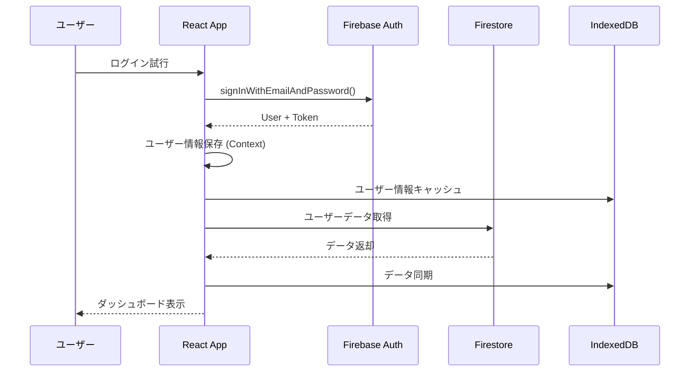

# セキュリティ設計書

## 1. 認証フロー

### 1.1 認証シーケンス



### 1.2 認証方式

**Email/Password認証**:
```typescript
async function signUpWithEmail(email: string, password: string) {
  try {
    // Firebase Authentication
    const userCredential = await createUserWithEmailAndPassword(
      auth,
      email,
      password
    );
    
    // Firestoreにユーザープロファイル作成
    await setDoc(doc(db, 'users', userCredential.user.uid), {
      email: userCredential.user.email,
      displayName: '',
      createdAt: serverTimestamp(),
      updatedAt: serverTimestamp()
    });
    
    return userCredential.user;
  } catch (error) {
    throw new AppError(ErrorType.AUTH, 'サインアップに失敗しました', error);
  }
}
```

**Google OAuth認証**:
```typescript
async function signInWithGoogle() {
  try {
    const provider = new GoogleAuthProvider();
    const result = await signInWithPopup(auth, provider);
    
    // 初回ログイン時はユーザープロファイル作成
    const userRef = doc(db, 'users', result.user.uid);
    const userSnap = await getDoc(userRef);
    
    if (!userSnap.exists()) {
      await setDoc(userRef, {
        email: result.user.email,
        displayName: result.user.displayName,
        photoURL: result.user.photoURL,
        createdAt: serverTimestamp(),
        updatedAt: serverTimestamp()
      });
    }
    
    return result.user;
  } catch (error) {
    throw new AppError(ErrorType.AUTH, 'Googleログインに失敗しました', error);
  }
}
```

### 1.3 セッション管理

```typescript
// 認証状態の永続化
setPersistence(auth, browserLocalPersistence);

// 認証状態の監視
onAuthStateChanged(auth, async (user) => {
  if (user) {
    // ログイン状態: トークン更新
    const token = await user.getIdToken();
    localStorage.setItem('authToken', token);
    
    // IndexedDBからユーザーデータ読み込み
    await loadUserDataFromIndexedDB(user.uid);
  } else {
    // ログアウト状態: データクリア
    localStorage.removeItem('authToken');
    await clearIndexedDB();
  }
});
```

### 1.4 トークン更新

```typescript
// トークンの定期更新 (55分ごと)
setInterval(async () => {
  const user = auth.currentUser;
  if (user) {
    try {
      const token = await user.getIdToken(true); // 強制更新
      localStorage.setItem('authToken', token);
    } catch (error) {
      console.error('Token refresh failed:', error);
      // 再ログイン促進
      await signOut(auth);
    }
  }
}, 55 * 60 * 1000); // 55分
```

## 2. Firestore Security Rules

### 2.1 基本ルール

```javascript
rules_version = '2';
service cloud.firestore {
  match /databases/{database}/documents {
    
    // ヘルパー関数
    function isAuthenticated() {
      return request.auth != null;
    }
    
    function isOwner(userId) {
      return isAuthenticated() && request.auth.uid == userId;
    }
    
    function hasValidTimestamp() {
      return request.resource.data.updatedAt == request.time;
    }
    
    // ユーザードキュメント
    match /users/{userId} {
      allow read: if isOwner(userId);
      allow create: if isOwner(userId) && hasValidTimestamp();
      allow update: if isOwner(userId) && hasValidTimestamp();
      allow delete: if false; // ユーザー削除は管理画面から
      
      // 人物サブコレクション
      match /persons/{personId} {
        allow read: if isOwner(userId);
        allow create: if isOwner(userId) && hasValidTimestamp();
        allow update: if isOwner(userId) && hasValidTimestamp();
        allow delete: if isOwner(userId);
      }
      
      // 贈答品サブコレクション
      match /gifts/{giftId} {
        allow read: if isOwner(userId);
        allow create: if isOwner(userId) 
                      && hasValidTimestamp()
                      && validateGift(request.resource.data);
        allow update: if isOwner(userId) 
                      && hasValidTimestamp()
                      && validateGift(request.resource.data);
        allow delete: if isOwner(userId);
        
        // お返しサブコレクション
        match /returns/{returnId} {
          allow read: if isOwner(userId);
          allow create: if isOwner(userId) && hasValidTimestamp();
          allow update: if isOwner(userId) && hasValidTimestamp();
          allow delete: if isOwner(userId);
        }
      }
      
      // リマインダーサブコレクション
      match /reminders/{reminderId} {
        allow read: if isOwner(userId);
        allow create: if isOwner(userId) && hasValidTimestamp();
        allow update: if isOwner(userId) && hasValidTimestamp();
        allow delete: if isOwner(userId);
      }
    }
    
    // バリデーション関数
    function validateGift(gift) {
      return gift.giftName is string
          && gift.giftName.size() >= 1
          && gift.giftName.size() <= 200
          && gift.receivedDate is timestamp
          && gift.category in ['結婚祝い', '出産祝い', 'お見舞い', 'お祝い', '香典・お悔やみ', '季節の贈り物', 'その他']
          && gift.returnStatus in ['pending', 'completed', 'not_required']
          && (gift.amount is number ? gift.amount >= 0 : true);
    }
  }
}
```

### 2.2 読み取り制限

```javascript
// クエリ制限 (1回のクエリで最大100件まで)
match /users/{userId}/gifts/{giftId} {
  allow list: if isOwner(userId) 
              && request.query.limit <= 100;
}
```

## 3. Firebase Storage Security Rules

### 3.1 画像ストレージルール

```javascript
rules_version = '2';
service firebase.storage {
  match /b/{bucket}/o {
    
    // ヘルパー関数
    function isAuthenticated() {
      return request.auth != null;
    }
    
    function isOwner(userId) {
      return request.auth.uid == userId;
    }
    
    function isImage() {
      return request.resource.contentType.matches('image/.*');
    }
    
    function isUnder10MB() {
      return request.resource.size < 10 * 1024 * 1024;
    }
    
    // ユーザーごとの画像保存
    match /users/{userId}/{allPaths=**} {
      allow read: if isOwner(userId);
      allow write: if isOwner(userId) 
                   && isImage() 
                   && isUnder10MB();
      allow delete: if isOwner(userId);
    }
  }
}
```

### 3.2 アップロード制限

- **ファイルタイプ**: 画像のみ (image/jpeg, image/png, image/webp)
- **ファイルサイズ**: 1ファイル最大10MB
- **合計容量**: ユーザーごとに500MB (アプリ側で制御)

## 4. データ保護

### 4.1 クライアント側暗号化 (Phase 3実装)

```typescript
// 機密データの暗号化
import { encrypt, decrypt } from 'crypto-js/aes';

function encryptSensitiveData(data: string, key: string): string {
  return encrypt(data, key).toString();
}

function decryptSensitiveData(encrypted: string, key: string): string {
  return decrypt(encrypted, key).toString();
}

// 使用例: 連絡先情報の暗号化
const encrypted = encryptSensitiveData(person.contact, userKey);
```

### 4.2 個人情報の取り扱い

| データ種別 | 保存場所 | 暗号化 | アクセス制御 |
|---|---|---|---|
| メールアドレス | Firebase Auth | ○ | Firebase管理 |
| パスワード | Firebase Auth | ○ | 非可逆ハッシュ |
| 氏名・関係性 | Firestore | × | Security Rules |
| 連絡先 | Firestore | △ (将来) | Security Rules |
| 写真 | Storage | × | Security Rules |
| メモ | Firestore | × | Security Rules |

### 4.3 IndexedDBのセキュリティ

**注意点**:
- IndexedDBは暗号化されていない
- 同一オリジンからのみアクセス可能
- ブラウザのプライベートモードでは消去される

**対策**:
- 機密性の高いデータはFirestoreのみに保存
- デバイスロック推奨の案内表示

## 5. XSS・CSRF対策

### 5.1 XSS (Cross-Site Scripting) 対策

```typescript
// ユーザー入力のサニタイゼーション
import DOMPurify from 'dompurify';

function sanitizeInput(input: string): string {
  return DOMPurify.sanitize(input, {
    ALLOWED_TAGS: [],
    ALLOWED_ATTR: []
  });
}

// 使用例
const safeName = sanitizeInput(userInput.name);
const safeMemo = sanitizeInput(userInput.memo);
```

**React標準の対策**:
- JSX内でのテキストは自動エスケープ
- `dangerouslySetInnerHTML`の使用禁止

### 5.2 CSRF (Cross-Site Request Forgery) 対策

**Firebase Authentication自動対応**:
- Firebaseトークンベース認証により自動防御
- Same-Site Cookie属性

## 6. API制限・レート制限

### 6.1 Firebase制限

| サービス | 無料枠制限 | 対策 |
|---|---|---|
| Firestore読み取り | 50K/日 | IndexedDBキャッシュ |
| Firestore書き込み | 20K/日 | バッチ処理、同期制御 |
| Storage | 5GB | 画像圧縮、削除機能 |
| Authentication | 無制限 | - |

### 6.2 クライアント側制限

```typescript
// API呼び出し制限 (Debounce)
import { debounce } from 'lodash-es';

const debouncedSearch = debounce((query: string) => {
  searchGifts(query);
}, 300); // 300ms待機

// バッチ書き込み
async function batchUpdateGifts(updates: GiftUpdate[]) {
  const batch = writeBatch(db);
  
  updates.forEach(update => {
    const ref = doc(db, 'users', userId, 'gifts', update.id);
    batch.update(ref, update.data);
  });
  
  // 最大500件まで
  if (updates.length <= 500) {
    await batch.commit();
  }
}
```

## 7. 監査ログ (Phase 3実装)

### 7.1 ログ記録

```typescript
// 重要操作のログ記録
interface AuditLog {
  userId: string;
  action: 'create' | 'update' | 'delete';
  resource: string;
  resourceId: string;
  timestamp: Timestamp;
  ipAddress?: string;
}

async function logAction(log: AuditLog) {
  await addDoc(collection(db, 'auditLogs'), log);
}
```

### 7.2 記録対象

- ユーザー登録・削除
- 認証試行 (成功・失敗)
- データの作成・更新・削除
- 画像のアップロード・削除

## 8. セキュリティチェックリスト

### 8.1 Phase 3実装時チェック

- [ ] Firebase Security Rules設定
- [ ] Storage Security Rules設定
- [ ] 認証フロー実装
- [ ] トークン更新機能
- [ ] ログアウト機能
- [ ] XSSサニタイゼーション
- [ ] HTTPS強制 (Firebase Hosting自動)
- [ ] 機密データ暗号化
- [ ] 監査ログ実装

### 8.2 Phase 4以降チェック

- [ ] レート制限強化
- [ ] セキュリティヘッダー設定
- [ ] 定期的なセキュリティレビュー
- [ ] 高度な脅威検知

## 9. 脆弱性対応

### 9.1 依存パッケージの監視

```bash
# 定期的な脆弱性チェック
npm audit

# 自動修正
npm audit fix
```

### 9.2 Firebase Security Check

- Firebase Consoleでのセキュリティアラート監視
- 異常なアクセスパターンの検知
- 定期的なSecurity Rulesレビュー

## 10. プライバシーポリシー

### 10.1 収集データ

- メールアドレス (認証用)
- 贈答品情報 (ユーザー入力)
- 人物情報 (ユーザー入力)
- 写真 (ユーザーアップロード)

### 10.2 データ利用目的

- アプリケーション機能提供
- マルチデバイス同期
- データバックアップ

### 10.3 第三者提供

- なし (Firebase除く)
- 広告配信時はGoogle AdSense (Phase 5)

### 10.4 データ削除

- ユーザーからの削除リクエスト対応
- アカウント削除時の全データ削除機能

