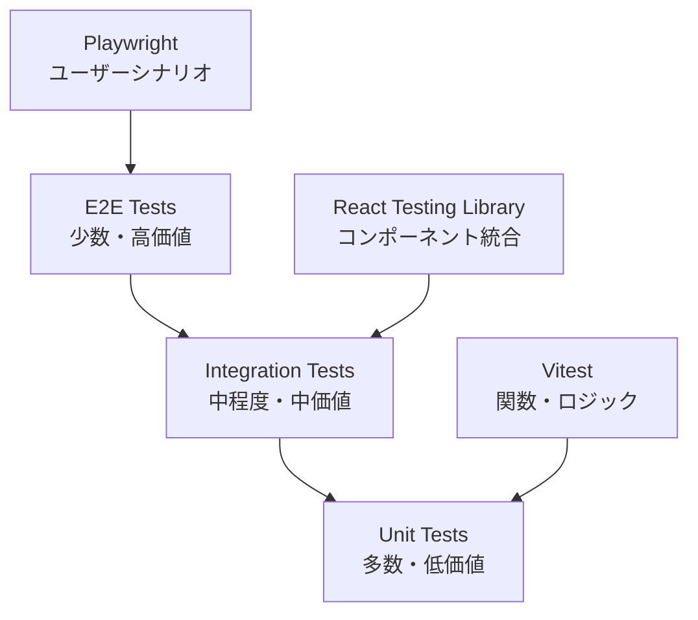

# デプロイ・運用設計書

## 1. ビルド構成

### 1.1 プロジェクト構成

```
iwailist_web/
├── src/                  # ソースコード
│   ├── components/       # Reactコンポーネント
│   ├── hooks/           # カスタムフック
│   ├── services/        # ビジネスロジック
│   ├── lib/             # ユーティリティ
│   ├── types/           # TypeScript型定義
│   ├── assets/          # 静的アセット
│   ├── App.tsx
│   └── main.tsx
├── public/              # 静的ファイル
│   ├── manifest.json    # PWA Manifest
│   ├── sw.js           # Service Worker
│   └── icons/          # アプリアイコン
├── requirements/        # 要件定義
│   └── requirements.md
├── design/              # 設計書
│   ├── 01_architecture.md
│   ├── 02_database.md
│   ├── 03_ui_design.md
│   ├── 04_api_design.md
│   ├── 05_security.md
│   ├── 06_deployment.md
│   ├── .nvmrc
│   ├── .node-version
│   └── .tool-versions
├── tests/               # テストファイル
│   ├── unit/           # 単体テスト
│   ├── integration/    # 統合テスト
│   ├── e2e/           # E2Eテスト
│   └── __mocks__/     # モックファイル
├── .github/            # GitHub Actions
│   └── workflows/
│       ├── test.yml
│       └── deploy.yml
├── .nvmrc              # Node.jsバージョン指定
├── .node-version       # Node.jsバージョン指定(代替)
├── .tool-versions      # asdfバージョン管理
├── index.html
├── vite.config.ts
├── vitest.config.ts    # テスト設定
├── playwright.config.ts # E2Eテスト設定
├── tsconfig.json
├── package.json
├── .env.example
└── README.md
```

### 1.2 Vite設定

```typescript
// vite.config.ts
import { defineConfig } from 'vite';
import react from '@vitejs/plugin-react';
import { VitePWA } from 'vite-plugin-pwa';

export default defineConfig({
  plugins: [
    react(),
    VitePWA({
      registerType: 'autoUpdate',
      manifest: {
        name: '祝い品管理',
        short_name: 'Iwailist',
        description: '祝い品の受け取りとお返しを管理するアプリ',
        theme_color: '#3B82F6',
        background_color: '#ffffff',
        display: 'standalone',
        icons: [
          {
            src: '/icons/icon-192.png',
            sizes: '192x192',
            type: 'image/png'
          },
          {
            src: '/icons/icon-512.png',
            sizes: '512x512',
            type: 'image/png'
          }
        ]
      },
      workbox: {
        globPatterns: ['**/*.{js,css,html,ico,png,svg}'],
        runtimeCaching: [
          {
            urlPattern: /^https:\/\/firebasestorage\.googleapis\.com\/.*/i,
            handler: 'CacheFirst',
            options: {
              cacheName: 'firebase-storage',
              expiration: {
                maxEntries: 100,
                maxAgeSeconds: 60 * 60 * 24 * 30 // 30日
              }
            }
          }
        ]
      }
    })
  ],
  build: {
    target: 'esnext',
    outDir: 'dist',
    sourcemap: false,
    rollupOptions: {
      output: {
        manualChunks: {
          'react-vendor': ['react', 'react-dom', 'react-router-dom'],
          'firebase': ['firebase/app', 'firebase/auth', 'firebase/firestore', 'firebase/storage']
        }
      }
    }
  },
  esbuild: {
    target: 'esnext'
  }
});
```

### 1.3 package.json (推奨バージョン)

```json
{
  "name": "iwailist-web",
  "private": true,
  "version": "0.1.0",
  "type": "module",
  "scripts": {
    "dev": "vite",
    "build": "tsc && vite build",
    "preview": "vite preview",
    "test": "vitest",
    "test:ui": "vitest --ui",
    "test:coverage": "vitest --coverage",
    "test:e2e": "playwright test",
    "test:e2e:ui": "playwright test --ui",
    "lint": "eslint . --ext ts,tsx --report-unused-disable-directives --max-warnings 0",
    "lint:fix": "eslint . --ext ts,tsx --fix",
    "type-check": "tsc --noEmit"
  },
  "dependencies": {
    "react": "^19.0.0",
    "react-dom": "^19.0.0",
    "react-router-dom": "^6.26.0",
    "firebase": "^11.0.0",
    "chart.js": "^4.4.0",
    "date-fns": "^3.6.0",
    "idb": "^7.1.1",
    "dompurify": "^3.0.8",
    "lodash-es": "^4.17.21"
  },
  "devDependencies": {
    "@types/react": "^18.3.0",
    "@types/react-dom": "^18.3.0",
    "@types/dompurify": "^3.0.5",
    "@vitejs/plugin-react": "^4.3.0",
    "typescript": "^5.2.2",
    "vite": "^7.0.0",
    "vite-plugin-pwa": "^0.20.0",
    "@vitest/ui": "^1.0.0",
    "@vitest/coverage-v8": "^1.0.0",
    "vitest": "^1.0.0",
    "@playwright/test": "^1.40.0",
    "@testing-library/react": "^14.0.0",
    "@testing-library/jest-dom": "^6.0.0",
    "@testing-library/user-event": "^14.0.0",
    "jsdom": "^23.0.0",
    "eslint": "^8.0.0",
    "@typescript-eslint/eslint-plugin": "^6.0.0",
    "@typescript-eslint/parser": "^6.0.0",
    "eslint-plugin-react": "^7.33.0",
    "eslint-plugin-react-hooks": "^4.6.0"
  }
}
```

### 1.4 バージョン管理設定

**Node.jsバージョン管理 (nvm)**:
```bash
# .nvmrc
22.12.0
```

**asdfバージョン管理 (推奨)**:
```bash
# .tool-versions
nodejs 22.12.0
firebase 13.0.0
```

**バージョン管理ツールのセットアップ**:
```bash
# nvmを使用する場合
curl -o- https://raw.githubusercontent.com/nvm-sh/nvm/v0.39.0/install.sh | bash
nvm install 22.12.0
nvm use 22.12.0

# asdfを使用する場合 (推奨)
git clone https://github.com/asdf-vm/asdf.git ~/.asdf --branch v0.14.0
asdf plugin add nodejs
asdf plugin add firebase
asdf install
```

### 1.5 デプロイ戦略

**インフラ管理 (Terraform)**:
- **目的**: Firebaseリソースの初期設定・管理
- **管理対象**: Firebase Project, Firestore, Storage, Authentication設定
- **実行タイミング**: 初回セットアップ時、インフラ変更時のみ

**アプリケーションデプロイ (Firebase CLI)**:
- **目的**: アプリケーションのビルド・デプロイ
- **管理対象**: Webアプリケーション、Hosting設定
- **実行タイミング**: コード変更のたびに

**デプロイフロー**:
1. **初回**: TerraformでFirebaseリソース作成
2. **継続**: Firebase CLIでアプリケーションデプロイ
3. **インフラ変更時**: Terraformでリソース更新

**設定ファイル構成**:
```
terraform/              # インフラ管理 (初回のみ)
├── main.tf
├── variables.tf
├── firebase.tf
└── outputs.tf

firebase.json           # アプリデプロイ設定
.firebaserc            # Firebase プロジェクト設定
```

### 1.6 環境変数

```bash
# .env.production
VITE_FIREBASE_API_KEY=your_api_key
VITE_FIREBASE_AUTH_DOMAIN=your_project.firebaseapp.com
VITE_FIREBASE_PROJECT_ID=your_project_id
VITE_FIREBASE_STORAGE_BUCKET=your_project.appspot.com
VITE_FIREBASE_MESSAGING_SENDER_ID=your_sender_id
VITE_FIREBASE_APP_ID=your_app_id
```

```bash
# terraform/terraform.tfvars (実装時に作成)
project_id = "your-project-id"
region = "asia-northeast1"
environment = "prod"
google_oauth_client_id = "your-google-client-id"
google_oauth_client_secret = "your-google-client-secret"
firebase_api_key = "your-firebase-api-key"
firebase_messaging_sender_id = "your-messaging-sender-id"
firebase_app_id = "your-firebase-app-id"
```

## 2. Firebase CLI デプロイ設定

### 2.1 firebase.json

```json
{
  "hosting": {
    "public": "dist",
    "ignore": [
      "firebase.json",
      "**/.*",
      "**/node_modules/**"
    ],
    "rewrites": [
      {
        "source": "**",
        "destination": "/index.html"
      }
    ],
    "headers": [
      {
        "source": "**/*.@(js|css)",
        "headers": [
          {
            "key": "Cache-Control",
            "value": "public, max-age=31536000, immutable"
          }
        ]
      },
      {
        "source": "**/*.@(jpg|jpeg|png|webp|svg)",
        "headers": [
          {
            "key": "Cache-Control",
            "value": "public, max-age=604800"
          }
        ]
      },
      {
        "source": "**",
        "headers": [
          {
            "key": "X-Content-Type-Options",
            "value": "nosniff"
          },
          {
            "key": "X-Frame-Options",
            "value": "DENY"
          },
          {
            "key": "X-XSS-Protection",
            "value": "1; mode=block"
          }
        ]
      }
    ]
  }
}
```

### 2.2 デプロイコマンド

```bash
# アプリケーションビルド
npm run build

# Firebase初期化 (初回のみ)
firebase init hosting

# 本番デプロイ
firebase deploy --only hosting

# プレビューデプロイ (テスト用)
firebase hosting:channel:deploy preview

# ステージングデプロイ
firebase hosting:channel:deploy staging
```

### 2.3 .firebaserc

```json
{
  "projects": {
    "default": "your-project-id-dev",
    "staging": "your-project-id-staging",
    "production": "your-project-id-prod"
  }
}
```

### 2.4 環境別設定

**開発環境 (.env.development)**:
```bash
VITE_FIREBASE_API_KEY=dev_api_key
VITE_FIREBASE_AUTH_DOMAIN=your-project-dev.firebaseapp.com
VITE_FIREBASE_PROJECT_ID=your-project-id-dev
VITE_FIREBASE_STORAGE_BUCKET=your-project-dev.appspot.com
VITE_FIREBASE_MESSAGING_SENDER_ID=dev_sender_id
VITE_FIREBASE_APP_ID=dev_app_id
VITE_APP_ENV=development
```

**ステージング環境 (.env.staging)**:
```bash
VITE_FIREBASE_API_KEY=staging_api_key
VITE_FIREBASE_AUTH_DOMAIN=your-project-staging.firebaseapp.com
VITE_FIREBASE_PROJECT_ID=your-project-id-staging
VITE_FIREBASE_STORAGE_BUCKET=your-project-staging.appspot.com
VITE_FIREBASE_MESSAGING_SENDER_ID=staging_sender_id
VITE_FIREBASE_APP_ID=staging_app_id
VITE_APP_ENV=staging
```

**本番環境 (.env.production)**:
```bash
VITE_FIREBASE_API_KEY=prod_api_key
VITE_FIREBASE_AUTH_DOMAIN=your-project-prod.firebaseapp.com
VITE_FIREBASE_PROJECT_ID=your-project-id-prod
VITE_FIREBASE_STORAGE_BUCKET=your-project-prod.appspot.com
VITE_FIREBASE_MESSAGING_SENDER_ID=prod_sender_id
VITE_FIREBASE_APP_ID=prod_app_id
VITE_APP_ENV=production
```

## 3. テスト戦略

### 3.1 テストピラミッド



### 3.2 テスト設定

**Vitest設定 (vitest.config.ts)**:
```typescript
import { defineConfig } from 'vitest/config'
import react from '@vitejs/plugin-react'

export default defineConfig({
  plugins: [react()],
  test: {
    globals: true,
    environment: 'jsdom',
    setupFiles: ['./tests/setup.ts'],
    coverage: {
      provider: 'v8',
      reporter: ['text', 'json', 'html'],
      exclude: [
        'node_modules/',
        'tests/',
        '**/*.d.ts',
        '**/*.config.*'
      ]
    }
  }
})
```

**Playwright設定 (playwright.config.ts)**:
```typescript
import { defineConfig, devices } from '@playwright/test'

export default defineConfig({
  testDir: './tests/e2e',
  fullyParallel: true,
  forbidOnly: !!process.env.CI,
  retries: process.env.CI ? 2 : 0,
  workers: process.env.CI ? 1 : undefined,
  reporter: 'html',
  use: {
    baseURL: 'http://localhost:4173',
    trace: 'on-first-retry',
  },
  projects: [
    {
      name: 'chromium',
      use: { ...devices['Desktop Chrome'] },
    },
    {
      name: 'firefox',
      use: { ...devices['Desktop Firefox'] },
    },
    {
      name: 'webkit',
      use: { ...devices['Desktop Safari'] },
    },
  ],
  webServer: {
    command: 'npm run build && npm run preview',
    url: 'http://localhost:4173',
    reuseExistingServer: !process.env.CI,
  },
})
```

### 3.3 テストカバレッジ目標

| テスト種別 | カバレッジ目標 | 対象 |
|---|---|---|
| Unit Tests | 80%+ | ビジネスロジック、ユーティリティ |
| Integration Tests | 60%+ | コンポーネント統合 |
| E2E Tests | 主要シナリオ | ユーザーフロー |

## 4. CI/CD構成

### 4.1 GitHub Actions

```yaml
# .github/workflows/deploy.yml
name: Deploy to Firebase Hosting

on:
  push:
    branches:
      - main
  pull_request:
    branches:
      - main

jobs:
  test:
    runs-on: ubuntu-latest
    
    steps:
      - uses: actions/checkout@v4
      
      - name: Setup Node.js
        uses: actions/setup-node@v4
        with:
          node-version-file: '.nvmrc'
          cache: 'npm'
      
      - name: Install dependencies
        run: npm ci
      
      - name: Type check
        run: npm run type-check
      
      - name: Lint
        run: npm run lint
      
      - name: Unit tests
        run: npm run test:coverage
      
      - name: Upload coverage
        uses: codecov/codecov-action@v3
        with:
          file: ./coverage/lcov.info
      
      - name: Build
        env:
          VITE_FIREBASE_API_KEY: ${{ secrets.FIREBASE_API_KEY }}
          VITE_FIREBASE_AUTH_DOMAIN: ${{ secrets.FIREBASE_AUTH_DOMAIN }}
          VITE_FIREBASE_PROJECT_ID: ${{ secrets.FIREBASE_PROJECT_ID }}
          VITE_FIREBASE_STORAGE_BUCKET: ${{ secrets.FIREBASE_STORAGE_BUCKET }}
          VITE_FIREBASE_MESSAGING_SENDER_ID: ${{ secrets.FIREBASE_MESSAGING_SENDER_ID }}
          VITE_FIREBASE_APP_ID: ${{ secrets.FIREBASE_APP_ID }}
        run: npm run build
      
      - name: E2E tests
        run: npm run test:e2e

  deploy:
    runs-on: ubuntu-latest
    needs: test
    if: github.ref == 'refs/heads/main'
    
    steps:
      - uses: actions/checkout@v4
      
      - name: Setup Node.js
        uses: actions/setup-node@v4
        with:
          node-version-file: '.nvmrc'
          cache: 'npm'
      
      - name: Install dependencies
        run: npm ci
      
      - name: Build
        env:
          VITE_FIREBASE_API_KEY: ${{ secrets.FIREBASE_API_KEY }}
          VITE_FIREBASE_AUTH_DOMAIN: ${{ secrets.FIREBASE_AUTH_DOMAIN }}
          VITE_FIREBASE_PROJECT_ID: ${{ secrets.FIREBASE_PROJECT_ID }}
          VITE_FIREBASE_STORAGE_BUCKET: ${{ secrets.FIREBASE_STORAGE_BUCKET }}
          VITE_FIREBASE_MESSAGING_SENDER_ID: ${{ secrets.FIREBASE_MESSAGING_SENDER_ID }}
          VITE_FIREBASE_APP_ID: ${{ secrets.FIREBASE_APP_ID }}
        run: npm run build
      
      - name: Deploy to Firebase Hosting
        uses: FirebaseExtended/action-hosting-deploy@v0
        with:
          repoToken: ${{ secrets.GITHUB_TOKEN }}
          firebaseServiceAccount: ${{ secrets.FIREBASE_SERVICE_ACCOUNT }}
          channelId: live
          projectId: ${{ secrets.FIREBASE_PROJECT_ID }}
```

## 5. 監視・メンテナンス

### 4.1 パフォーマンス監視

**Firebase Performance Monitoring**:
```typescript
import { initializePerformance } from 'firebase/performance';

const perf = initializePerformance(app);

// 自動計測
// - ページロード時間
// - ネットワークリクエスト
```

### 4.2 エラー追跡

**Firebase Crashlytics (将来実装)**:
```typescript
// エラーログ送信
function logError(error: Error) {
  console.error(error);
  // 将来: Crashlyticsに送信
}
```

### 4.3 アクセス解析

**Firebase Analytics**:
```typescript
import { getAnalytics, logEvent } from 'firebase/analytics';

const analytics = getAnalytics(app);

// カスタムイベント
logEvent(analytics, 'gift_created', {
  category: gift.category,
  amount: gift.amount
});
```

## 6. バックアップ戦略

### 5.1 Firestoreバックアップ

**自動バックアップ (Blaze Planで利用可能)**:
```bash
# 手動エクスポート
gcloud firestore export gs://[BUCKET_NAME]/[EXPORT_PREFIX]

# 定期的なエクスポート (Cloud Scheduler + Cloud Functions)
```

### 5.2 データエクスポート機能

ユーザーが自分のデータをエクスポートできる機能を実装:

```typescript
async function exportUserData(userId: string): Promise<Blob> {
  const gifts = await getAllGifts(userId);
  const persons = await getAllPersons(userId);
  
  const data = {
    gifts,
    persons,
    exportDate: new Date().toISOString()
  };
  
  return new Blob(
    [JSON.stringify(data, null, 2)],
    { type: 'application/json' }
  );
}
```

## 7. スケーリング計画

### 6.1 無料枠から有料プランへの移行

| 指標 | 無料枠上限 | 警告しきい値 | 移行判断 |
|---|---|---|---|
| Firestore読み取り | 50K/日 | 40K/日 (80%) | 連続3日超過 |
| Firestore書き込み | 20K/日 | 16K/日 (80%) | 連続3日超過 |
| Storage | 5GB | 4GB (80%) | 容量到達 |

### 6.2 Blaze Plan (従量課金)

**費用試算**:
- Firestore読み取り: $0.06 / 100K回
- Firestore書き込み: $0.18 / 100K回
- Storage: $0.026 / GB

**個人利用での想定コスト**: 月額$0-5

## 8. メンテナンス計画

### 7.1 定期メンテナンス

| タスク | 頻度 | 内容 |
|---|---|---|
| 依存パッケージ更新 | 月次 | `npm update`, セキュリティパッチ |
| Firebase SDK更新 | 四半期 | 新機能・パフォーマンス向上 |
| Security Rules見直し | 四半期 | 脆弱性チェック |
| データベースクリーンアップ | 年次 | 不要データの削除 |

### 7.2 アップデート手順

```bash
# 1. バージョン管理ツールの更新
# nvmを使用する場合
nvm install 22.12.0
nvm use 22.12.0

# asdfを使用する場合
asdf update
asdf install nodejs 22.12.0
asdf install firebase 13.0.0
asdf install terraform 1.6.0

# 2. 依存関係の更新
npm update

# 3. セキュリティパッチの適用
npm audit fix

# 4. メジャーバージョンアップの場合
npm install react@^19.0.0 react-dom@^19.0.0
npm install @types/react@^18.3.0 @types/react-dom@^18.3.0

# 5. バージョン固定ファイルの更新
# .nvmrc または .tool-versions を更新

# 6. テスト
npm run build

# 7. ステージング環境にデプロイ
firebase hosting:channel:deploy staging

# 8. 本番環境にデプロイ
git push origin main  # GitHub Actions自動デプロイ
```

### 7.2.1 チーム開発でのバージョン統一

```bash
# プロジェクト初回セットアップ
git clone <repository>
cd iwailist_web

# nvmを使用する場合
nvm install  # .nvmrcからバージョン読み込み
nvm use

# asdfを使用する場合
asdf install  # .tool-versionsからバージョン読み込み

# 依存関係インストール
npm install
```

### 7.3 バージョン管理戦略

| ツール | バージョン管理 | 設定ファイル | 備考 |
|---|---|---|---|
| Node.js | nvm / asdf | .nvmrc / .tool-versions | プロジェクト固有 |
| Firebase CLI | asdf / npm | .tool-versions / package.json | グローバルインストール |
| Terraform | asdf / tfenv | .tool-versions / .terraform-version | インフラ管理 |
| TypeScript | npm | package.json | プロジェクト依存 |
| Vite | npm | package.json | プロジェクト依存 |
| React | npm | package.json | プロジェクト依存 |

### 7.4 バージョン要件

| ツール | 最小バージョン | 推奨バージョン | 管理方法 |
|---|---|---|---|
| Node.js | 20.19+ | 22.12.0 | nvm / asdf |
| React | 19.0+ | 19.0.0 | npm |
| TypeScript | 5.2+ | 5.2.2 | npm |
| Vite | 7.0+ | 7.0.0 | npm |
| Firebase | 11.0+ | 11.0.0 | npm / asdf |
| Firebase CLI | 13.0+ | 13.0.0 | asdf / npm |
| Terraform | 1.5+ | 1.6+ | asdf / tfenv |

## 9. トラブルシューティング

### 8.1 よくある問題

| 問題 | 原因 | 解決方法 |
|---|---|---|
| ビルドエラー | 環境変数未設定 | `.env`ファイル確認 |
| 認証失敗 | Firebase設定ミス | `firebase.json`確認 |
| 同期されない | ネットワークエラー | オフライン対応確認 |
| 画像表示されない | CORS設定 | Storage Rules確認 |

### 8.2 ロールバック手順

```bash
# Firebase Hostingの以前のバージョンにロールバック
firebase hosting:clone SOURCE_SITE_ID:SOURCE_CHANNEL_ID TARGET_SITE_ID:live
```

## 10. ドキュメント管理

### 9.1 ドキュメント一覧

- **README.md**: プロジェクト概要、セットアップ手順
- **requirements/requirements.md**: 要件定義
- **design/**: 設計書 (本ディレクトリ)
- **API.md**: API仕様詳細 (将来作成)

### 9.2 更新ルール

- 機能追加時は要件定義・設計書も更新
- バージョン管理: セマンティックバージョニング
- 変更履歴: CHANGELOG.md

## 11. 開発環境セットアップ

### 10.1 初回セットアップ手順

```bash
# 1. リポジトリクローン
git clone <repository-url>
cd iwailist_web

# 2. バージョン管理ツールのセットアップ
# nvmを使用する場合
curl -o- https://raw.githubusercontent.com/nvm-sh/nvm/v0.39.0/install.sh | bash
source ~/.bashrc
nvm install  # .nvmrcからバージョン読み込み
nvm use

# asdfを使用する場合 (推奨)
git clone https://github.com/asdf-vm/asdf.git ~/.asdf --branch v0.14.0
echo '. "$HOME/.asdf/asdf.sh"' >> ~/.bashrc
echo '. "$HOME/.asdf/completions/asdf.bash"' >> ~/.bashrc
source ~/.bashrc
asdf plugin add nodejs
asdf plugin add firebase
asdf plugin add terraform
asdf install  # .tool-versionsからバージョン読み込み

# 3. 依存関係インストール
npm install

# 4. 環境変数設定
cp .env.example .env.local
# .env.localを編集してFirebase設定を追加

# 5. Firebase プロジェクト初期化 (初回のみ)
# GCPプロジェクト作成
gcloud projects create your-project-id --name="Iwailist Web"
gcloud config set project your-project-id

# 必要なAPI有効化
gcloud services enable firebase.googleapis.com
gcloud services enable firestore.googleapis.com
gcloud services enable storage.googleapis.com
gcloud services enable identitytoolkit.googleapis.com

# Firebase CLIでプロジェクト初期化
firebase login
firebase init hosting
firebase use your-project-id

# 6. 開発サーバー起動
cd ..
npm run dev
```

### 10.2 チームメンバー向けセットアップ

```bash
# 既存プロジェクトのセットアップ
git pull origin main

# バージョン確認・切り替え
nvm use  # または asdf install

# 依存関係更新
npm install

# 開発サーバー起動
npm run dev
```

## 12. Phase別デプロイ計画

### Phase 1: ローカル開発 (✅ 完了)
- ✅ ローカルホストで動作確認
- ✅ IndexedDB動作検証
- ✅ バージョン管理環境構築
- ✅ 基本機能の実装（贈答品管理、人物管理、統計）

### Phase 2: PWA対応 (✅ 実装完了)
- ✅ Service Worker実装
- ✅ オフライン動作
- ✅ PWAインストールプロンプト
- ✅ 自動更新通知機能
- ✅ キャッシュ戦略実装
- ✅ オフラインインジケーター
- ✅ E2Eテストの拡充
- 🔄 カメラ撮影機能（次回実装予定）
- 🔄 バージョン管理の自動化（次回実装予定）

### Phase 3: Firebase統合
- Firebase Hosting初回デプロイ
- 認証・データ同期テスト
- 本番環境公開

### Phase 4: 正式リリース
- GitHub Actions CI/CD構築
- パフォーマンス監視開始
- ユーザーフィードバック収集
- お返し管理機能
- リマインダー機能

### Phase 5: 拡張機能
- 広告統合
- OCR/AI解析
- 高度な分析機能
- 複数人での共有機能

