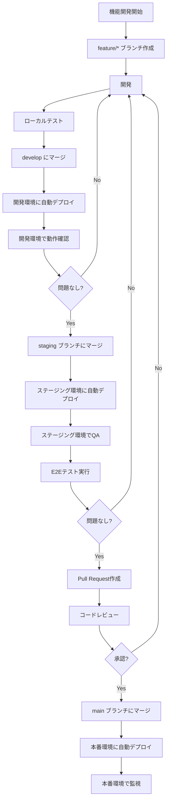

# Firebase マルチ環境戦略設計書

## 1. 概要

本ドキュメントでは、Iwailist WebアプリケーションにおけるFirebaseの環境分離戦略について定義します。開発環境、ステージング環境、本番環境の3つの環境を適切に分離し、安全かつ効率的な開発・デプロイフローを実現します。

### 1.1 目的

- 開発中の変更が本番環境に影響を与えないようにする
- 本番デプロイ前にステージング環境で十分なテストを行う
- 環境ごとに独立したデータとリソースを管理する
- セキュリティリスクを最小化する

### 1.2 対象読者

- 開発者
- DevOpsエンジニア
- プロジェクトマネージャー

## 2. 環境分離戦略

### 2.1 推奨アプローチ：複数Firebaseプロジェクト方式

Firebaseの環境分離には、**複数のFirebaseプロジェクトを作成する方式**が最もベストプラクティスとされています。

#### メリット

✅ **完全な分離**
- データベース、ストレージ、認証が完全に独立
- 開発環境の障害が本番に影響しない
- セキュリティリスクの最小化

✅ **柔軟な権限管理**
- 環境ごとに異なるアクセス権限を設定可能
- 開発者には開発環境のみアクセス許可
- 本番環境は限られたメンバーのみ

✅ **課金の分離**
- 環境ごとの利用状況を個別に追跡
- コスト分析が容易
- 開発環境の無駄な費用発生を検知しやすい

✅ **独立したスケーリング**
- 各環境で異なるリソース設定が可能
- 本番環境のみスケールアップ

#### デメリット

❌ **管理コストの増加**
- 複数のプロジェクトを管理する必要がある
- Security Rulesなどの設定を各環境で同期

❌ **コストの増加**
- 環境ごとにFirebaseリソースが必要
- ただし、開発/ステージングは無料枠内で運用可能

### 2.2 非推奨アプローチ：単一プロジェクト + コレクション分離

単一のFirebaseプロジェクト内でコレクション名やパスで環境を分離する方法は**非推奨**です。

#### 理由

- ❌ データの誤操作リスク（本番データの削除など）
- ❌ 認証ユーザーが環境間で共有される
- ❌ Security Rulesが複雑化
- ❌ 課金が一緒になり、コスト分析が困難

## 3. 環境定義

### 3.1 開発環境（Development）

**目的**: 機能開発、バグ修正、実験的な変更

| 項目 | 設定値 |
|------|--------|
| Firebase Project ID | `iwailist-dev` または `cocottu-iwailist-dev` |
| プロジェクト名 | Iwailist Web - Development |
| Hosting URL | `https://iwailist-dev.web.app` |
| 自動デプロイ | feature ブランチへのプッシュ |
| データ保持期間 | 30日（定期的にクリーンアップ） |
| 使用者 | 全開発者 |

**特徴**:
- 頻繁なデプロイが可能
- 実験的な機能の追加OK
- テストデータの使用
- エラーログは最小限

**セキュリティ設定**:
```javascript
// 開発環境用のFirestore Rules（緩い設定）
rules_version = '2';
service cloud.firestore {
  match /databases/{database}/documents {
    // 開発環境では認証済みユーザーは全データにアクセス可能
    match /{document=**} {
      allow read, write: if request.auth != null;
    }
  }
}
```

### 3.2 ステージング環境（Staging）

**目的**: 本番デプロイ前の最終検証、QA、パフォーマンステスト

| 項目 | 設定値 |
|------|--------|
| Firebase Project ID | `iwailist-staging` または `cocottu-iwailist-staging` |
| プロジェクト名 | Iwailist Web - Staging |
| Hosting URL | `https://iwailist-staging.web.app` |
| 自動デプロイ | develop ブランチへのマージ |
| データ保持期間 | 90日 |
| 使用者 | 開発者、QAエンジニア、ステークホルダー |

**特徴**:
- 本番環境と同じ構成
- 本番に近いデータ量でテスト
- 本番と同じSecurity Rules
- 詳細なエラーログとモニタリング

**セキュリティ設定**:
```javascript
// ステージング環境用のFirestore Rules（本番と同等）
rules_version = '2';
service cloud.firestore {
  match /databases/{database}/documents {
    // 本番と同じルールを適用
    match /users/{userId} {
      allow read: if request.auth != null;
      allow write: if request.auth != null && request.auth.uid == userId;
    }
    
    match /persons/{personId} {
      allow read: if request.auth != null && 
                    request.auth.uid == resource.data.userId;
      allow write: if request.auth != null && 
                     request.auth.uid == request.resource.data.userId;
    }
    
    // ... 他のルール
  }
}
```

### 3.3 本番環境（Production）

**目的**: エンドユーザーへのサービス提供

| 項目 | 設定値 |
|------|--------|
| Firebase Project ID | `cocottu-iwailist`（既存） |
| プロジェクト名 | Iwailist Web - Production |
| Hosting URL | `https://iwailist.cocottu.com`（カスタムドメイン） |
| 自動デプロイ | main ブランチへのマージ（承認必須） |
| データ保持期間 | 無期限（GDPR準拠のクリーンアップあり） |
| 使用者 | エンドユーザー |

**特徴**:
- 高可用性
- 自動バックアップ
- 厳格なSecurity Rules
- 包括的なモニタリングとアラート
- CDN経由での配信

**セキュリティ設定**:
```javascript
// 本番環境用のFirestore Rules（最も厳格）
rules_version = '2';
service cloud.firestore {
  match /databases/{database}/documents {
    // 厳格なバリデーション付き
    match /users/{userId} {
      allow read: if request.auth != null;
      allow create: if request.auth != null && 
                      request.auth.uid == userId &&
                      validateUserData(request.resource.data);
      allow update: if request.auth != null && 
                      request.auth.uid == userId &&
                      validateUserData(request.resource.data);
      allow delete: if request.auth != null && 
                      request.auth.uid == userId;
    }
    
    // 詳細なバリデーション関数
    function validateUserData(data) {
      return data.keys().hasAll(['displayName', 'email', 'createdAt']) &&
             data.displayName is string &&
             data.displayName.size() > 0 &&
             data.displayName.size() <= 100 &&
             data.email is string &&
             data.email.matches('.*@.*\\..*');
    }
    
    // ... 他の厳格なルール
  }
}
```

## 4. 技術実装

### 4.1 Firebaseプロジェクトの作成

各環境用に3つのFirebaseプロジェクトを作成します。

```bash
# Firebase Console で以下を作成
# 1. iwailist-dev または cocottu-iwailist-dev
# 2. iwailist-staging または cocottu-iwailist-staging
# 3. cocottu-iwailist（既存）
```

各プロジェクトで以下を有効化：
- Authentication（Email/Password、Google）
- Firestore Database（asia-northeast1）
- Cloud Storage
- Hosting

### 4.2 .firebasercの設定

プロジェクトルートの`.firebaserc`ファイルで複数プロジェクトを管理します。

```json
{
  "projects": {
    "development": "cocottu-iwailist-dev",
    "staging": "cocottu-iwailist-staging",
    "production": "cocottu-iwailist"
  },
  "targets": {},
  "etags": {}
}
```

**使用方法**:

```bash
# 開発環境を使用
firebase use development
firebase deploy

# ステージング環境を使用
firebase use staging
firebase deploy

# 本番環境を使用
firebase use production
firebase deploy

# 現在使用中のプロジェクトを確認
firebase use
```

### 4.3 環境変数の管理

#### 4.3.1 ローカル開発環境

プロジェクトルートに環境ごとの`.env`ファイルを作成します。

**`.env.development`** (Git管理外):
```bash
# Development環境
VITE_FIREBASE_API_KEY=AIza...（開発環境のAPIキー）
VITE_FIREBASE_AUTH_DOMAIN=cocottu-iwailist-dev.firebaseapp.com
VITE_FIREBASE_PROJECT_ID=cocottu-iwailist-dev
VITE_FIREBASE_STORAGE_BUCKET=cocottu-iwailist-dev.appspot.com
VITE_FIREBASE_MESSAGING_SENDER_ID=123456789
VITE_FIREBASE_APP_ID=1:123456789:web:xxx
VITE_APP_ENV=development
```

**`.env.staging`** (Git管理外):
```bash
# Staging環境
VITE_FIREBASE_API_KEY=AIza...（ステージング環境のAPIキー）
VITE_FIREBASE_AUTH_DOMAIN=cocottu-iwailist-staging.firebaseapp.com
VITE_FIREBASE_PROJECT_ID=cocottu-iwailist-staging
VITE_FIREBASE_STORAGE_BUCKET=cocottu-iwailist-staging.appspot.com
VITE_FIREBASE_MESSAGING_SENDER_ID=987654321
VITE_FIREBASE_APP_ID=1:987654321:web:yyy
VITE_APP_ENV=staging
```

**`.env.production`** (Git管理外):
```bash
# Production環境
VITE_FIREBASE_API_KEY=AIza...（本番環境のAPIキー）
VITE_FIREBASE_AUTH_DOMAIN=cocottu-iwailist.firebaseapp.com
VITE_FIREBASE_PROJECT_ID=cocottu-iwailist
VITE_FIREBASE_STORAGE_BUCKET=cocottu-iwailist.appspot.com
VITE_FIREBASE_MESSAGING_SENDER_ID=111222333
VITE_FIREBASE_APP_ID=1:111222333:web:zzz
VITE_APP_ENV=production
```

**`.env.example`** (Git管理):
```bash
# Firebase Configuration（サンプル）
VITE_FIREBASE_API_KEY=your_api_key_here
VITE_FIREBASE_AUTH_DOMAIN=your_project.firebaseapp.com
VITE_FIREBASE_PROJECT_ID=your_project_id
VITE_FIREBASE_STORAGE_BUCKET=your_project.appspot.com
VITE_FIREBASE_MESSAGING_SENDER_ID=your_sender_id
VITE_FIREBASE_APP_ID=your_app_id
VITE_APP_ENV=development
```

#### 4.3.2 package.jsonのスクリプト更新

```json
{
  "scripts": {
    "dev": "vite --mode development",
    "dev:staging": "vite --mode staging",
    "dev:prod": "vite --mode production",
    "build": "tsc && vite build --mode production",
    "build:dev": "tsc && vite build --mode development",
    "build:staging": "tsc && vite build --mode staging",
    "build:prod": "tsc && vite build --mode production",
    "preview": "vite preview",
    "deploy:dev": "npm run build:dev && firebase use development && firebase deploy",
    "deploy:staging": "npm run build:staging && firebase use staging && firebase deploy",
    "deploy:prod": "npm run build:prod && firebase use production && firebase deploy"
  }
}
```

### 4.4 GitHub Actionsの設定

#### 4.4.1 GitHub Secretsの設定

各環境用のシークレットをGitHubに登録します。

**開発環境用**:
- `DEV_FIREBASE_API_KEY`
- `DEV_FIREBASE_AUTH_DOMAIN`
- `DEV_FIREBASE_PROJECT_ID`
- `DEV_FIREBASE_STORAGE_BUCKET`
- `DEV_FIREBASE_MESSAGING_SENDER_ID`
- `DEV_FIREBASE_APP_ID`
- `DEV_FIREBASE_TOKEN` または `DEV_FIREBASE_SERVICE_ACCOUNT`

**ステージング環境用**:
- `STAGING_FIREBASE_API_KEY`
- `STAGING_FIREBASE_AUTH_DOMAIN`
- `STAGING_FIREBASE_PROJECT_ID`
- `STAGING_FIREBASE_STORAGE_BUCKET`
- `STAGING_FIREBASE_MESSAGING_SENDER_ID`
- `STAGING_FIREBASE_APP_ID`
- `STAGING_FIREBASE_TOKEN` または `STAGING_FIREBASE_SERVICE_ACCOUNT`

**本番環境用**（既存）:
- `FIREBASE_API_KEY`
- `FIREBASE_AUTH_DOMAIN`
- `FIREBASE_PROJECT_ID`
- `FIREBASE_STORAGE_BUCKET`
- `FIREBASE_MESSAGING_SENDER_ID`
- `FIREBASE_APP_ID`
- `FIREBASE_TOKEN` または `FIREBASE_SERVICE_ACCOUNT`

#### 4.4.2 ワークフローファイルの更新

**`.github/workflows/deploy-development.yml`**:
```yaml
name: Deploy to Development

on:
  push:
    branches:
      - develop
      - feature/**

jobs:
  deploy-dev:
    runs-on: ubuntu-latest
    steps:
      - uses: actions/checkout@v4
      
      - name: Setup Node.js
        uses: actions/setup-node@v4
        with:
          node-version: '22'
          cache: 'npm'
      
      - name: Install dependencies
        run: npm ci
      
      - name: Build for Development
        env:
          VITE_FIREBASE_API_KEY: ${{ secrets.DEV_FIREBASE_API_KEY }}
          VITE_FIREBASE_AUTH_DOMAIN: ${{ secrets.DEV_FIREBASE_AUTH_DOMAIN }}
          VITE_FIREBASE_PROJECT_ID: ${{ secrets.DEV_FIREBASE_PROJECT_ID }}
          VITE_FIREBASE_STORAGE_BUCKET: ${{ secrets.DEV_FIREBASE_STORAGE_BUCKET }}
          VITE_FIREBASE_MESSAGING_SENDER_ID: ${{ secrets.DEV_FIREBASE_MESSAGING_SENDER_ID }}
          VITE_FIREBASE_APP_ID: ${{ secrets.DEV_FIREBASE_APP_ID }}
          VITE_APP_ENV: development
        run: npm run build:dev
      
      - name: Deploy to Firebase Development
        uses: FirebaseExtended/action-hosting-deploy@v0
        with:
          repoToken: ${{ secrets.GITHUB_TOKEN }}
          firebaseServiceAccount: ${{ secrets.DEV_FIREBASE_SERVICE_ACCOUNT }}
          channelId: live
          projectId: ${{ secrets.DEV_FIREBASE_PROJECT_ID }}
```

**`.github/workflows/deploy-staging.yml`**:
```yaml
name: Deploy to Staging

on:
  push:
    branches:
      - staging
  pull_request:
    branches:
      - main

jobs:
  test:
    runs-on: ubuntu-latest
    steps:
      - uses: actions/checkout@v4
      - uses: actions/setup-node@v4
        with:
          node-version: '22'
          cache: 'npm'
      - run: npm ci
      - run: npm run lint
      - run: npm run test:run
  
  deploy-staging:
    needs: test
    runs-on: ubuntu-latest
    steps:
      - uses: actions/checkout@v4
      
      - name: Setup Node.js
        uses: actions/setup-node@v4
        with:
          node-version: '22'
          cache: 'npm'
      
      - name: Install dependencies
        run: npm ci
      
      - name: Build for Staging
        env:
          VITE_FIREBASE_API_KEY: ${{ secrets.STAGING_FIREBASE_API_KEY }}
          VITE_FIREBASE_AUTH_DOMAIN: ${{ secrets.STAGING_FIREBASE_AUTH_DOMAIN }}
          VITE_FIREBASE_PROJECT_ID: ${{ secrets.STAGING_FIREBASE_PROJECT_ID }}
          VITE_FIREBASE_STORAGE_BUCKET: ${{ secrets.STAGING_FIREBASE_STORAGE_BUCKET }}
          VITE_FIREBASE_MESSAGING_SENDER_ID: ${{ secrets.STAGING_FIREBASE_MESSAGING_SENDER_ID }}
          VITE_FIREBASE_APP_ID: ${{ secrets.STAGING_FIREBASE_APP_ID }}
          VITE_APP_ENV: staging
        run: npm run build:staging
      
      - name: Deploy to Firebase Staging
        uses: FirebaseExtended/action-hosting-deploy@v0
        with:
          repoToken: ${{ secrets.GITHUB_TOKEN }}
          firebaseServiceAccount: ${{ secrets.STAGING_FIREBASE_SERVICE_ACCOUNT }}
          channelId: live
          projectId: ${{ secrets.STAGING_FIREBASE_PROJECT_ID }}
      
      - name: Run E2E Tests
        run: npm run test:e2e
        env:
          PLAYWRIGHT_TEST_BASE_URL: https://${{ secrets.STAGING_FIREBASE_PROJECT_ID }}.web.app
```

**`.github/workflows/deploy-production.yml`**:
```yaml
name: Deploy to Production

on:
  push:
    branches:
      - main
  workflow_dispatch:
    inputs:
      confirm:
        description: '本番デプロイを実行しますか？（yes/no）'
        required: true
        default: 'no'

jobs:
  test:
    runs-on: ubuntu-latest
    steps:
      - uses: actions/checkout@v4
      - uses: actions/setup-node@v4
        with:
          node-version: '22'
          cache: 'npm'
      - run: npm ci
      - run: npm run lint
      - run: npm run test:run
      - run: npm run test:e2e
  
  deploy-production:
    needs: test
    runs-on: ubuntu-latest
    # 手動実行時は確認が必要
    if: |
      (github.event_name == 'push') ||
      (github.event_name == 'workflow_dispatch' && github.event.inputs.confirm == 'yes')
    
    # 本番デプロイには承認が必要（GitHub Environmentを使用）
    environment:
      name: production
      url: https://iwailist.cocottu.com
    
    steps:
      - uses: actions/checkout@v4
      
      - name: Setup Node.js
        uses: actions/setup-node@v4
        with:
          node-version: '22'
          cache: 'npm'
      
      - name: Install dependencies
        run: npm ci
      
      - name: Build for Production
        env:
          VITE_FIREBASE_API_KEY: ${{ secrets.FIREBASE_API_KEY }}
          VITE_FIREBASE_AUTH_DOMAIN: ${{ secrets.FIREBASE_AUTH_DOMAIN }}
          VITE_FIREBASE_PROJECT_ID: ${{ secrets.FIREBASE_PROJECT_ID }}
          VITE_FIREBASE_STORAGE_BUCKET: ${{ secrets.FIREBASE_STORAGE_BUCKET }}
          VITE_FIREBASE_MESSAGING_SENDER_ID: ${{ secrets.FIREBASE_MESSAGING_SENDER_ID }}
          VITE_FIREBASE_APP_ID: ${{ secrets.FIREBASE_APP_ID }}
          VITE_APP_ENV: production
        run: npm run build:prod
      
      - name: Deploy to Firebase Production
        uses: FirebaseExtended/action-hosting-deploy@v0
        with:
          repoToken: ${{ secrets.GITHUB_TOKEN }}
          firebaseServiceAccount: ${{ secrets.FIREBASE_SERVICE_ACCOUNT }}
          channelId: live
          projectId: ${{ secrets.FIREBASE_PROJECT_ID }}
      
      - name: Deploy Firestore Rules
        run: |
          npm install -g firebase-tools
          firebase deploy --only firestore:rules,firestore:indexes --token ${{ secrets.FIREBASE_TOKEN }} --project ${{ secrets.FIREBASE_PROJECT_ID }}
      
      - name: Deploy Storage Rules
        run: |
          firebase deploy --only storage --token ${{ secrets.FIREBASE_TOKEN }} --project ${{ secrets.FIREBASE_PROJECT_ID }}
      
      - name: Notify Success
        if: success()
        run: echo "✅ Production deployment successful!"
```

### 4.5 Security Rulesの環境別管理

環境ごとに異なるSecurity Rulesを適用する場合、ファイルを分離します。

```
project-root/
├── firestore.rules.dev        # 開発環境用（緩い）
├── firestore.rules.staging    # ステージング用（本番同等）
├── firestore.rules            # 本番環境用（厳格）
├── storage.rules.dev
├── storage.rules.staging
├── storage.rules
└── firebase.json
```

**firebase.json の更新**:
```json
{
  "hosting": {
    "public": "dist",
    "ignore": ["firebase.json", "**/.*", "**/node_modules/**"],
    "rewrites": [
      {
        "source": "**",
        "destination": "/index.html"
      }
    ]
  },
  "firestore": {
    "rules": "firestore.rules",
    "indexes": "firestore.indexes.json"
  },
  "storage": {
    "rules": "storage.rules"
  }
}
```

デプロイ時に環境に応じてファイルを切り替え：

```bash
# 開発環境デプロイ前
cp firestore.rules.dev firestore.rules
cp storage.rules.dev storage.rules
firebase use development
firebase deploy

# ステージング環境デプロイ前
cp firestore.rules.staging firestore.rules
cp storage.rules.staging storage.rules
firebase use staging
firebase deploy

# 本番環境は元のファイルを使用
firebase use production
firebase deploy
```

### 4.6 コード内での環境判定

`src/config/firebase.ts`で環境を判定：

```typescript
// 環境変数から現在の環境を取得
export const APP_ENV = import.meta.env.VITE_APP_ENV || 'development';

// 環境判定ヘルパー
export const isDevelopment = () => APP_ENV === 'development';
export const isStaging = () => APP_ENV === 'staging';
export const isProduction = () => APP_ENV === 'production';

// 環境に応じた設定
export const getFirebaseConfig = () => {
  const config = {
    apiKey: import.meta.env.VITE_FIREBASE_API_KEY,
    authDomain: import.meta.env.VITE_FIREBASE_AUTH_DOMAIN,
    projectId: import.meta.env.VITE_FIREBASE_PROJECT_ID,
    storageBucket: import.meta.env.VITE_FIREBASE_STORAGE_BUCKET,
    messagingSenderId: import.meta.env.VITE_FIREBASE_MESSAGING_SENDER_ID,
    appId: import.meta.env.VITE_FIREBASE_APP_ID,
  };

  // 開発環境では設定を検証
  if (isDevelopment()) {
    console.log('🔧 Running in DEVELOPMENT mode');
    console.log('Firebase Project:', config.projectId);
  }

  // 本番環境ではログを抑制
  if (isProduction()) {
    console.log('🚀 Running in PRODUCTION mode');
  }

  return config;
};

// 環境に応じた機能フラグ
export const FEATURE_FLAGS = {
  enableDebugMode: isDevelopment(),
  enablePerformanceMonitoring: isProduction() || isStaging(),
  enableAnalytics: isProduction(),
  enableErrorReporting: isProduction() || isStaging(),
  showDevTools: isDevelopment(),
};
```

使用例：

```typescript
import { isDevelopment, FEATURE_FLAGS } from './config/firebase';

// デバッグログは開発環境のみ
if (FEATURE_FLAGS.enableDebugMode) {
  console.log('Debug info:', data);
}

// パフォーマンス測定は本番とステージングのみ
if (FEATURE_FLAGS.enablePerformanceMonitoring) {
  performance.mark('start-operation');
  // ... 処理
  performance.mark('end-operation');
  performance.measure('operation', 'start-operation', 'end-operation');
}
```

## 5. デプロイフロー

### 5.1 ブランチ戦略

```
main (本番)
  ↑
staging (ステージング)
  ↑
develop (開発)
  ↑
feature/* (機能開発)
```

### 5.2 デプロイフロー図



### 5.3 各環境へのデプロイトリガー

| 環境 | トリガー | 承認 | テスト実行 |
|------|---------|------|-----------|
| 開発 | develop ブランチへのプッシュ | 不要 | Lintのみ |
| ステージング | staging ブランチへのプッシュ | 不要 | Unit + E2E |
| 本番 | main ブランチへのマージ | **必須** | Full Test Suite |

## 6. データ管理戦略

### 6.1 テストデータの管理

#### 開発環境
- ダミーデータの自動生成スクリプトを使用
- 定期的（毎月）にデータをリセット
- 個人情報を含まないダミーデータのみ

```typescript
// scripts/seed-dev-data.ts
import { initializeApp } from 'firebase/app';
import { getFirestore, collection, addDoc } from 'firebase/firestore';
import { faker } from '@faker-js/faker';

const seedDevelopmentData = async () => {
  // 開発環境の設定で初期化
  const app = initializeApp(developmentConfig);
  const db = getFirestore(app);

  // ダミーユーザーを作成
  for (let i = 0; i < 10; i++) {
    await addDoc(collection(db, 'users'), {
      displayName: faker.person.fullName(),
      email: faker.internet.email(),
      createdAt: new Date(),
      updatedAt: new Date(),
    });
  }

  console.log('✅ Development data seeded successfully');
};
```

#### ステージング環境
- 本番環境からの匿名化データをコピー
- 個人情報はマスキング
- データ量は本番の50-70%程度

```bash
# 本番データをエクスポート（個人情報を除外）
firebase firestore:export gs://backup-bucket/staging-data --project production

# ステージング環境にインポート
firebase firestore:import gs://backup-bucket/staging-data --project staging
```

#### 本番環境
- 実データ
- 定期的なバックアップ（毎日）
- GDPR準拠のデータ保持ポリシー

### 6.2 バックアップ戦略

```bash
# 自動バックアップスクリプト（Cloud Schedulerで実行）
#!/bin/bash
DATE=$(date +%Y%m%d_%H%M%S)

# 本番環境のバックアップ
firebase firestore:export gs://iwailist-backups/production/${DATE} \
  --project cocottu-iwailist

# 保持期間：30日
# 30日以前のバックアップは自動削除（Lifecycle設定）
```

## 7. モニタリングとロギング

### 7.1 環境別モニタリング設定

| 監視項目 | 開発 | ステージング | 本番 |
|---------|------|------------|------|
| エラーログ | 基本 | 詳細 | 詳細 + アラート |
| パフォーマンス | ❌ | ✅ | ✅ |
| 使用量 | 基本 | 詳細 | 詳細 + アラート |
| セキュリティ | 基本 | 詳細 | 詳細 + アラート |

### 7.2 Firebase Analyticsの設定

```typescript
// src/utils/analytics.ts
import { getAnalytics, logEvent } from 'firebase/analytics';
import { isProduction } from '../config/firebase';

export const initAnalytics = () => {
  // 本番環境のみAnalyticsを有効化
  if (isProduction()) {
    const analytics = getAnalytics();
    return analytics;
  }
  return null;
};

export const logAnalyticsEvent = (eventName: string, params?: object) => {
  if (isProduction()) {
    const analytics = getAnalytics();
    logEvent(analytics, eventName, params);
  }
};
```

### 7.3 エラートラッキング

開発環境とステージング環境では、エラーをコンソールに出力。本番環境では、エラートラッキングサービス（Sentry等）に送信。

```typescript
// src/utils/errorTracking.ts
import { isProduction, isStaging } from '../config/firebase';

export const reportError = (error: Error, context?: object) => {
  if (isProduction()) {
    // Sentryなどのエラートラッキングサービスに送信
    // Sentry.captureException(error, { contexts: context });
    console.error('Production Error:', error, context);
  } else if (isStaging()) {
    console.warn('Staging Error:', error, context);
  } else {
    console.log('Development Error:', error, context);
  }
};
```

## 8. コスト管理

### 8.1 環境別コスト予算

| 環境 | 月間予算（目安） | Sparkプラン | Blazeプラン |
|------|----------------|-------------|------------|
| 開発 | $0 | ✅ 無料枠内 | - |
| ステージング | $0-10 | ✅ 無料枠内 | 必要に応じて |
| 本番 | $50-200 | ❌ | ✅ 必須 |

### 8.2 コスト最適化施策

**開発環境**:
- データの定期的なクリーンアップ（30日ごと）
- Storage内の不要ファイル削除
- 使用しない機能は無効化

**ステージング環境**:
- 営業時間外はスケールダウン（不可の場合は監視）
- テスト後のデータクリーンアップ
- 不要なホスティング履歴の削除

**本番環境**:
- Cloud CDNの有効化
- 画像の最適化
- インデックスの最適化
- 不要なリージョンのバックアップ削除

### 8.3 コスト監視

Firebase Consoleで各環境の使用量を週次で確認：

- Firestore: 読み取り/書き込み回数
- Storage: ストレージ使用量、ダウンロード量
- Hosting: 帯域幅使用量
- Authentication: アクティブユーザー数

## 9. セキュリティ

### 9.1 環境別アクセス制御

#### IAM権限設定

| 役割 | 開発環境 | ステージング環境 | 本番環境 |
|------|---------|----------------|---------|
| 開発者（Junior） | Editor | Viewer | - |
| 開発者（Senior） | Editor | Editor | Viewer |
| Tech Lead | Owner | Owner | Editor |
| DevOps | Owner | Owner | Owner |

#### Firebase Consoleアクセス

```bash
# プロジェクトメンバーを追加（Firebase Console）
# 開発環境: すべての開発者に Editor 権限
# ステージング環境: シニア開発者に Editor 権限
# 本番環境: Tech Lead と DevOps のみ Editor/Owner 権限
```

### 9.2 API キーの制限

**開発環境**:
- HTTP referrer制限: `localhost:*`, `*.firebaseapp.com`
- IP制限: なし

**ステージング環境**:
- HTTP referrer制限: `*.firebaseapp.com`, `staging.iwailist.com`
- IP制限: オフィスIPのみ（オプション）

**本番環境**:
- HTTP referrer制限: `iwailist.cocottu.com`, `*.iwailist.cocottu.com`
- IP制限: なし（CDN経由）
- Android/iOS アプリの署名証明書を登録

### 9.3 認証設定

各環境で独立したユーザーベースを管理：

```typescript
// 環境別認証ドメイン設定
// 開発: cocottu-iwailist-dev.firebaseapp.com
// ステージング: cocottu-iwailist-staging.firebaseapp.com
// 本番: iwailist.cocottu.com
```

### 9.4 Security Rulesのテスト

```bash
# Firestoreルールのテスト
firebase emulators:exec --only firestore "npm run test:firestore-rules"

# Storageルールのテスト
firebase emulators:exec --only storage "npm run test:storage-rules"
```

## 10. トラブルシューティング

### 10.1 よくある問題と解決方法

#### 問題1: 環境変数が読み込まれない

**症状**: ビルド時に環境変数が undefined になる

**原因**: 
- `.env`ファイル名が間違っている
- Viteサーバーが再起動されていない

**解決方法**:
```bash
# .envファイル名を確認
ls -la .env*

# 開発サーバーを再起動
npm run dev
```

#### 問題2: 間違った環境にデプロイしてしまった

**症状**: ステージング用の変更が本番にデプロイされた

**原因**: 
- `firebase use` で間違ったプロジェクトを選択
- GitHub Actionsのブランチ設定ミス

**解決方法**:
```bash
# 現在のプロジェクトを確認
firebase use

# 正しいプロジェクトに切り替え
firebase use production

# ロールバック（前のデプロイに戻す）
firebase hosting:rollback
```

#### 問題3: Security Rulesのデプロイに失敗

**症状**: Rules のデプロイでエラーが発生

**原因**: 
- ルールの構文エラー
- 権限不足

**解決方法**:
```bash
# ルールの検証
firebase firestore:rules:release --test-only

# エミュレーターでテスト
firebase emulators:start --only firestore
```

### 10.2 環境のリセット

開発環境をクリーンな状態に戻す：

```bash
# Firestoreのデータを削除（注意：実行前に確認！）
firebase firestore:delete --all-collections --project development

# Storageのファイルを削除
gsutil -m rm -r gs://cocottu-iwailist-dev.appspot.com/**
```

## 11. チェックリスト

### 11.1 環境セットアップチェックリスト

**開発環境**:
- [ ] Firebaseプロジェクト作成
- [ ] Authentication有効化（Email/Password、Google）
- [ ] Firestore Database作成
- [ ] Cloud Storage有効化
- [ ] Hosting有効化
- [ ] `.env.development` ファイル作成
- [ ] GitHub Secrets登録（DEV_*）
- [ ] ローカルでビルド確認
- [ ] デプロイ確認

**ステージング環境**:
- [ ] Firebaseプロジェクト作成
- [ ] Authentication有効化
- [ ] Firestore Database作成
- [ ] Cloud Storage有効化
- [ ] Hosting有効化
- [ ] `.env.staging` ファイル作成
- [ ] GitHub Secrets登録（STAGING_*）
- [ ] Security Rules デプロイ
- [ ] E2Eテスト実行
- [ ] デプロイ確認

**本番環境**:
- [ ] Firebaseプロジェクト確認（既存）
- [ ] `.env.production` ファイル作成
- [ ] GitHub Secrets確認
- [ ] GitHub Environment設定（承認フロー）
- [ ] カスタムドメイン設定
- [ ] SSL証明書確認
- [ ] Security Rules最終確認
- [ ] バックアップ設定
- [ ] モニタリング設定
- [ ] アラート設定

### 11.2 デプロイ前チェックリスト

- [ ] すべてのテストが通過
- [ ] Lint エラーなし
- [ ] 型チェック通過
- [ ] ステージング環境で動作確認済み
- [ ] パフォーマンステスト完了
- [ ] Security Rulesレビュー済み
- [ ] データマイグレーション（必要な場合）完了
- [ ] ロールバック手順確認済み
- [ ] ステークホルダーへの通知済み

## 12. 参考資料

### 12.1 公式ドキュメント

- [Firebase - Managing Multiple Environments](https://firebase.google.com/docs/projects/manage-installations)
- [Firebase CLI Reference](https://firebase.google.com/docs/cli)
- [GitHub Actions for Firebase](https://github.com/FirebaseExtended/action-hosting-deploy)
- [Vite - Env Variables and Modes](https://vitejs.dev/guide/env-and-mode.html)

### 12.2 ベストプラクティス

- **複数プロジェクト方式を採用**: 単一プロジェクトでの環境分離は避ける
- **環境変数は必ず外部化**: ハードコーディング厳禁
- **本番デプロイには承認フロー**: GitHub Environmentsを活用
- **Security Rulesは環境ごとに検証**: 開発環境の緩いルールを本番に適用しない
- **定期的なバックアップ**: 本番環境は毎日、ステージングは週次
- **コストモニタリング**: 週次で使用量を確認
- **ドキュメント更新**: 環境設定変更時は必ずドキュメント更新

### 12.3 関連ドキュメント

- [FIREBASE_SETUP.md](./FIREBASE_SETUP.md) - Firebase初期セットアップ
- [GITHUB_ACTIONS_SETUP.md](./GITHUB_ACTIONS_SETUP.md) - CI/CDセットアップ
- [PHASE3_DEPLOYMENT_GUIDE.md](./PHASE3_DEPLOYMENT_GUIDE.md) - デプロイガイド
- [SECURITY.md](../SECURITY.md) - セキュリティポリシー

## 13. まとめ

本設計書では、Iwailist WebアプリケーションにおけるFirebaseのマルチ環境戦略を定義しました。

**重要ポイント**:

1. ✅ **複数Firebaseプロジェクト方式を採用**
   - 開発、ステージング、本番で完全に分離
   - セキュリティリスクの最小化

2. ✅ **環境変数とGitHub Actionsで自動化**
   - ブランチ戦略に基づく自動デプロイ
   - 本番デプロイには承認フロー

3. ✅ **環境ごとに適切なSecurity Rules**
   - 開発: 緩い（開発効率優先）
   - ステージング: 本番同等（テスト環境）
   - 本番: 最も厳格（セキュリティ優先）

4. ✅ **コストとパフォーマンスの最適化**
   - 開発/ステージングは無料枠内
   - 本番環境は適切なスケーリング

この戦略により、安全で効率的な開発・デプロイフローを実現できます。

---

**作成日**: 2025-10-19  
**バージョン**: 1.0  
**作成者**: Cursor AI Assistant  
**最終更新**: 2025-10-19
