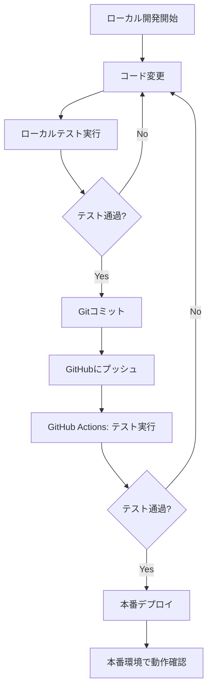

# 単一環境運用戦略設計書

## 1. 概要

本ドキュメントでは、Iwailist Webアプリケーションにおける**単一環境（本番環境のみ）**での運用戦略を定義します。開発環境、ステージング環境、本番環境を分離せず、本番環境のみで運用するシンプルな構成を採用します。

### 1.1 目的

- 運用コストの最小化（Firebaseプロジェクト1つのみ）
- 構成の簡素化（環境分離の複雑さを排除）
- デプロイプロセスの簡略化
- 小規模プロジェクトでの効率的な運用

### 1.2 対象読者

- 開発者
- プロジェクトマネージャー
- 運用担当者

### 1.3 適用範囲

この戦略は以下のような場合に適しています：

- 個人プロジェクトまたは小規模チーム
- 開発頻度がそれほど高くない
- 本番データのテストが許容される
- プロジェクト数の制約がある
- 運用コストを最小化したい

## 2. アーキテクチャ概要

### 2.1 構成

```
┌─────────────────────────────────────────┐
│         Firebase Project                 │
│      (cocottu-iwailist)                  │
│                                           │
│  ┌─────────────────────────────────┐    │
│  │   Authentication                 │    │
│  └─────────────────────────────────┘    │
│                                           │
│  ┌─────────────────────────────────┐    │
│  │   Firestore Database              │    │
│  │   (本番データ)                     │    │
│  └─────────────────────────────────┘    │
│                                           │
│  ┌─────────────────────────────────┐    │
│  │   Cloud Storage                  │    │
│  │   (本番データ)                     │    │
│  └─────────────────────────────────┘    │
│                                           │
│  ┌─────────────────────────────────┐    │
│  │   Firebase Hosting               │    │
│  │   (本番サイト)                     │    │
│  └─────────────────────────────────┘    │
└─────────────────────────────────────────┘
```

### 2.2 特徴

- **単一Firebaseプロジェクト**: `cocottu-iwailist` のみ
- **環境分離なし**: 開発・ステージング・本番の区別なし
- **直接デプロイ**: ローカルテスト → 本番デプロイ
- **データ管理**: 本番データのみ（開発用テストデータは必要に応じて手動で作成）

## 3. 開発フロー

### 3.1 ローカル開発



### 3.2 デプロイプロセス

1. **ローカル開発**
   - `npm run dev` でローカル開発サーバー起動
   - 本番Firebaseプロジェクトに接続（`.env.local`で設定）
   - 実際の本番データを使用（注意が必要）

2. **テスト実行**
   - `npm run test` でユニットテスト
   - `npm run test:e2e` でE2Eテスト（ローカル）
   - `npm run lint` でコード品質チェック

3. **GitHub Actions**
   - プッシュ時に自動でテスト実行
   - テスト通過後、mainブランチへのマージ時に自動デプロイ

4. **本番デプロイ**
   - `firebase deploy --only hosting` でホスティングにデプロイ
   - Firestore Rules、Storage Rulesも必要に応じてデプロイ

## 4. 技術実装

### 4.1 Firebaseプロジェクト設定

**`.firebaserc`**:

```json
{
  "projects": {
    "default": "cocottu-iwailist"
  },
  "targets": {},
  "etags": {}
}
```

**`firebase.json`**:

```json
{
  "hosting": {
    "public": "dist",
    "ignore": [
      "firebase.json",
      "**/.*",
      "**/node_modules/**"
    ],
    "rewrites": [
      {
        "source": "**",
        "destination": "/index.html"
      }
    ],
    "headers": [
      {
        "source": "**/*.@(js|css)",
        "headers": [
          {
            "key": "Cache-Control",
            "value": "public, max-age=31536000, immutable"
          }
        ]
      },
      {
        "source": "**/*.@(jpg|jpeg|png|webp|svg)",
        "headers": [
          {
            "key": "Cache-Control",
            "value": "public, max-age=604800"
          }
        ]
      },
      {
        "source": "**",
        "headers": [
          {
            "key": "X-Content-Type-Options",
            "value": "nosniff"
          },
          {
            "key": "X-Frame-Options",
            "value": "DENY"
          },
          {
            "key": "X-XSS-Protection",
            "value": "1; mode=block"
          }
        ]
      }
    ]
  },
  "firestore": {
    "database": "(default)",
    "location": "asia-northeast1",
    "rules": "firestore.rules",
    "indexes": "firestore.indexes.json"
  },
  "storage": {
    "rules": "storage.rules"
  }
}
```

### 4.2 環境変数設定

**`.env.local`** (Git管理外、ローカル開発用):

```bash
# Firebase Configuration（本番プロジェクト）
VITE_FIREBASE_API_KEY=your_api_key_here
VITE_FIREBASE_AUTH_DOMAIN=cocottu-iwailist.firebaseapp.com
VITE_FIREBASE_PROJECT_ID=cocottu-iwailist
VITE_FIREBASE_STORAGE_BUCKET=cocottu-iwailist.appspot.com
VITE_FIREBASE_MESSAGING_SENDER_ID=your_sender_id
VITE_FIREBASE_APP_ID=your_app_id
VITE_APP_ENV=production
```

**`.env.example`** (Git管理):

```bash
# Firebase Configuration（サンプル）
VITE_FIREBASE_API_KEY=your_api_key_here
VITE_FIREBASE_AUTH_DOMAIN=your_project.firebaseapp.com
VITE_FIREBASE_PROJECT_ID=your_project_id
VITE_FIREBASE_STORAGE_BUCKET=your_project.appspot.com
VITE_FIREBASE_MESSAGING_SENDER_ID=your_sender_id
VITE_FIREBASE_APP_ID=your_app_id
VITE_APP_ENV=production
```

**注意**: 単一環境では、環境変数に`VITE_APP_ENV=production`を設定します。

### 4.3 package.jsonスクリプト

```json
{
  "scripts": {
    "dev": "vite",
    "build": "tsc && vite build",
    "preview": "vite preview",
    "test": "vitest",
    "test:ui": "vitest --ui",
    "test:coverage": "vitest --coverage",
    "test:e2e": "playwright test",
    "test:e2e:ui": "playwright test --ui",
    "lint": "eslint . --ext ts,tsx --report-unused-disable-directives --max-warnings 0",
    "lint:fix": "eslint . --ext ts,tsx --fix",
    "type-check": "tsc --noEmit",
    "deploy": "npm run build && firebase deploy --only hosting",
    "deploy:rules": "firebase deploy --only firestore:rules,storage"
  }
}
```

### 4.4 Security Rules

単一環境では、本番用の厳格なSecurity Rulesを適用します。

**`firestore.rules`**:

```javascript
rules_version = '2';
service cloud.firestore {
  match /databases/{database}/documents {
    // ユーザー管理
    match /users/{userId} {
      allow read: if request.auth != null;
      allow create: if request.auth != null && 
                      request.auth.uid == userId &&
                      validateUserData(request.resource.data);
      allow update: if request.auth != null && 
                      request.auth.uid == userId &&
                      validateUserData(request.resource.data);
      allow delete: if request.auth != null && 
                      request.auth.uid == userId;
    }
    
    // 人物管理
    match /persons/{personId} {
      allow read: if request.auth != null && 
                    request.auth.uid == resource.data.userId;
      allow create: if request.auth != null && 
                      request.auth.uid == request.resource.data.userId &&
                      validatePersonData(request.resource.data);
      allow update: if request.auth != null && 
                      request.auth.uid == request.resource.data.userId &&
                      validatePersonData(request.resource.data);
      allow delete: if request.auth != null && 
                      request.auth.uid == resource.data.userId;
    }
    
    // 贈答品管理
    match /gifts/{giftId} {
      allow read: if request.auth != null && 
                    request.auth.uid == resource.data.userId;
      allow create: if request.auth != null && 
                      request.auth.uid == request.resource.data.userId &&
                      validateGiftData(request.resource.data);
      allow update: if request.auth != null && 
                      request.auth.uid == request.resource.data.userId &&
                      validateGiftData(request.resource.data);
      allow delete: if request.auth != null && 
                      request.auth.uid == resource.data.userId;
    }
    
    // バリデーション関数
    function validateUserData(data) {
      return data.keys().hasAll(['displayName', 'email', 'createdAt']) &&
             data.displayName is string &&
             data.displayName.size() > 0 &&
             data.displayName.size() <= 100 &&
             data.email is string &&
             data.email.matches('.*@.*\\..*');
    }
    
    function validatePersonData(data) {
      return data.keys().hasAll(['userId', 'name', 'createdAt']) &&
             data.userId is string &&
             data.name is string &&
             data.name.size() > 0 &&
             data.name.size() <= 100;
    }
    
    function validateGiftData(data) {
      return data.keys().hasAll(['userId', 'personId', 'name', 'amount', 'createdAt']) &&
             data.userId is string &&
             data.personId is string &&
             data.name is string &&
             data.name.size() > 0 &&
             data.amount is int &&
             data.amount > 0;
    }
  }
}
```

**`storage.rules`**:

```javascript
rules_version = '2';
service firebase.storage {
  match /b/{bucket}/o {
    match /{allPaths=**} {
      allow read: if request.auth != null;
      allow write: if request.auth != null && 
                     request.resource.size < 5 * 1024 * 1024 && // 5MB以下
                     request.resource.contentType.matches('image/.*') &&
                     request.resource.name.matches('.*\\.(jpg|jpeg|png|webp)$');
    }
  }
}
```

## 5. CI/CD構成

### 5.1 GitHub Actionsワークフロー

**`.github/workflows/test.yml`** (テスト実行):

```yaml
name: Test

on:
  push:
    branches: ['**']
  pull_request:
    branches: ['**']

jobs:
  test:
    runs-on: ubuntu-latest
    
    steps:
      - uses: actions/checkout@v4
      
      - name: Setup Node.js
        uses: actions/setup-node@v4
        with:
          node-version-file: '.nvmrc'
          cache: 'npm'
      
      - name: Install dependencies
        run: npm ci
      
      - name: Type check
        run: npm run type-check
      
      - name: Lint
        run: npm run lint
      
      - name: Unit tests
        run: npm run test:coverage
      
      - name: Build
        env:
          VITE_FIREBASE_API_KEY: ${{ secrets.FIREBASE_API_KEY }}
          VITE_FIREBASE_AUTH_DOMAIN: ${{ secrets.FIREBASE_AUTH_DOMAIN }}
          VITE_FIREBASE_PROJECT_ID: ${{ secrets.FIREBASE_PROJECT_ID }}
          VITE_FIREBASE_STORAGE_BUCKET: ${{ secrets.FIREBASE_STORAGE_BUCKET }}
          VITE_FIREBASE_MESSAGING_SENDER_ID: ${{ secrets.FIREBASE_MESSAGING_SENDER_ID }}
          VITE_FIREBASE_APP_ID: ${{ secrets.FIREBASE_APP_ID }}
          VITE_APP_ENV: production
        run: npm run build
```

**`.github/workflows/deploy.yml`** (本番デプロイ):

```yaml
name: Deploy to Production

on:
  push:
    branches:
      - main
  workflow_dispatch:

jobs:
  test:
    runs-on: ubuntu-latest
    
    steps:
      - uses: actions/checkout@v4
      
      - name: Setup Node.js
        uses: actions/setup-node@v4
        with:
          node-version-file: '.nvmrc'
          cache: 'npm'
      
      - name: Install dependencies
        run: npm ci
      
      - name: Type check
        run: npm run type-check
      
      - name: Lint
        run: npm run lint
      
      - name: Unit tests
        run: npm run test:coverage
      
      - name: Build
        env:
          VITE_FIREBASE_API_KEY: ${{ secrets.FIREBASE_API_KEY }}
          VITE_FIREBASE_AUTH_DOMAIN: ${{ secrets.FIREBASE_AUTH_DOMAIN }}
          VITE_FIREBASE_PROJECT_ID: ${{ secrets.FIREBASE_PROJECT_ID }}
          VITE_FIREBASE_STORAGE_BUCKET: ${{ secrets.FIREBASE_STORAGE_BUCKET }}
          VITE_FIREBASE_MESSAGING_SENDER_ID: ${{ secrets.FIREBASE_MESSAGING_SENDER_ID }}
          VITE_FIREBASE_APP_ID: ${{ secrets.FIREBASE_APP_ID }}
          VITE_APP_ENV: production
        run: npm run build

  deploy:
    needs: test
    runs-on: ubuntu-latest
    
    steps:
      - uses: actions/checkout@v4
      
      - name: Setup Node.js
        uses: actions/setup-node@v4
        with:
          node-version-file: '.nvmrc'
          cache: 'npm'
      
      - name: Install dependencies
        run: npm ci
      
      - name: Build
        env:
          VITE_FIREBASE_API_KEY: ${{ secrets.FIREBASE_API_KEY }}
          VITE_FIREBASE_AUTH_DOMAIN: ${{ secrets.FIREBASE_AUTH_DOMAIN }}
          VITE_FIREBASE_PROJECT_ID: ${{ secrets.FIREBASE_PROJECT_ID }}
          VITE_FIREBASE_STORAGE_BUCKET: ${{ secrets.FIREBASE_STORAGE_BUCKET }}
          VITE_FIREBASE_MESSAGING_SENDER_ID: ${{ secrets.FIREBASE_MESSAGING_SENDER_ID }}
          VITE_FIREBASE_APP_ID: ${{ secrets.FIREBASE_APP_ID }}
          VITE_APP_ENV: production
        run: npm run build
      
      - name: Deploy to Firebase Hosting
        uses: FirebaseExtended/action-hosting-deploy@v0
        with:
          repoToken: ${{ secrets.GITHUB_TOKEN }}
          firebaseServiceAccount: ${{ secrets.FIREBASE_SERVICE_ACCOUNT }}
          channelId: live
          projectId: ${{ secrets.FIREBASE_PROJECT_ID }}
      
      - name: Deploy Firestore Rules
        run: |
          npm install -g firebase-tools
          echo "${{ secrets.FIREBASE_SERVICE_ACCOUNT }}" > $HOME/firebase-service-account.json
          export GOOGLE_APPLICATION_CREDENTIALS=$HOME/firebase-service-account.json
          firebase deploy --only firestore:rules,firestore:indexes --project ${{ secrets.FIREBASE_PROJECT_ID }}
      
      - name: Deploy Storage Rules
        run: |
          firebase deploy --only storage --project ${{ secrets.FIREBASE_PROJECT_ID }}
```

### 5.2 GitHub Secrets

必要なシークレット（環境変数は1セットのみ）：

- `FIREBASE_API_KEY`: Firebase API キー
- `FIREBASE_AUTH_DOMAIN`: Auth ドメイン
- `FIREBASE_PROJECT_ID`: プロジェクトID（`cocottu-iwailist`）
- `FIREBASE_STORAGE_BUCKET`: Storage バケット
- `FIREBASE_MESSAGING_SENDER_ID`: Messaging Sender ID
- `FIREBASE_APP_ID`: App ID
- `FIREBASE_SERVICE_ACCOUNT`: Firebase サービスアカウント（JSON形式）

## 6. Terraform構成（オプション）

単一環境では、Terraformは初回セットアップ時のみ使用し、以降はFirebase CLIで管理します。

**`terraform/main.tf`** (初回セットアップ用):

```hcl
# Firebaseプロジェクトの初回セットアップのみ
# 通常の運用では使用しない

terraform {
  required_version = ">= 1.5.0"
  required_providers {
    google = {
      source  = "hashicorp/google"
      version = "~> 5.0"
    }
  }
}

provider "google" {
  project = var.project_id
  region  = var.region
}

# Firebaseプロジェクトは既に作成済みのため、ここでは参照のみ
# 実際のFirebaseリソースはFirebase CLIで管理
```

**注意**: 単一環境では、Terraformは最小限の使用にとどめ、Firebase CLIで直接管理することを推奨します。

## 7. データ管理

### 7.1 テストデータ

- ローカル開発時は、必要に応じて手動でテストデータを作成
- 本番データを使用する場合は、誤操作に注意
- テスト用のユーザーアカウントを作成して使用

### 7.2 バックアップ

```bash
# Firestoreデータのエクスポート（定期実行推奨）
gcloud firestore export gs://[BUCKET_NAME]/[EXPORT_PREFIX] \
  --project cocottu-iwailist

# Storageデータのバックアップ（必要に応じて）
gsutil -m cp -r gs://cocottu-iwailist.appspot.com gs://backup-bucket/
```

## 8. デプロイ手順

### 8.1 初回セットアップ

```bash
# 1. リポジトリクローン
git clone <repository-url>
cd iwailist_web

# 2. 依存関係インストール
npm install

# 3. 環境変数設定
cp .env.example .env.local
# .env.localを編集してFirebase設定を追加

# 4. Firebase CLIログイン
firebase login

# 5. Firebaseプロジェクト確認
firebase use cocottu-iwailist

# 6. Security Rulesデプロイ（初回のみ）
firebase deploy --only firestore:rules,storage

# 7. 開発サーバー起動
npm run dev
```

### 8.2 通常のデプロイ

```bash
# 1. コード変更
git add .
git commit -m "Update feature"
git push origin main

# 2. GitHub Actionsが自動でテストとデプロイを実行
# または手動でデプロイする場合:
npm run build
firebase deploy --only hosting
```

## 9. メリット・デメリット

### 9.1 メリット

- ✅ **運用コストの最小化**: Firebaseプロジェクト1つのみ
- ✅ **構成の簡素化**: 環境分離の複雑さがない
- ✅ **デプロイプロセスの簡略化**: 直接本番デプロイ
- ✅ **セットアップの容易さ**: 初期設定が簡単

### 9.2 デメリット

- ❌ **本番データへの影響リスク**: 開発中の誤操作で本番データに影響
- ❌ **テスト環境の欠如**: 本番環境でのみテスト
- ❌ **ロールバックの困難**: デプロイミス時の影響が大きい
- ❌ **開発時の注意が必要**: 本番データを扱うため慎重に

### 9.3 リスク軽減策

- **十分なテスト**: ローカルで十分なテストを実施
- **コードレビュー**: プルリクエストでレビュー
- **段階的デプロイ**: 小さな変更を頻繁にデプロイ
- **バックアップ**: 定期的なデータバックアップ
- **監視**: デプロイ後の動作確認

## 10. チェックリスト

### 10.1 初回セットアップ

- [ ] Firebaseプロジェクト作成（`cocottu-iwailist`）
- [ ] Authentication有効化（Email/Password、Google）
- [ ] Firestore Database作成（asia-northeast1）
- [ ] Cloud Storage有効化
- [ ] Hosting有効化
- [ ] `.env.local`ファイル作成
- [ ] GitHub Secrets登録
- [ ] Security Rulesデプロイ
- [ ] ローカルでビルド確認
- [ ] 初回デプロイ確認

### 10.2 デプロイ前チェック

- [ ] すべてのテストが通過
- [ ] Lintエラーなし
- [ ] 型チェック通過
- [ ] ローカルで動作確認済み
- [ ] 本番データへの影響を確認
- [ ] Security Rulesレビュー済み
- [ ] バックアップ取得済み（必要に応じて）

## 11. トラブルシューティング

### 11.1 よくある問題

**問題1: デプロイ後に動作しない**

**解決方法**:
```bash
# ビルドを確認
npm run build

# ローカルでプレビュー
npm run preview

# デプロイログを確認
firebase deploy --only hosting --debug
```

**問題2: Security Rulesが適用されない**

**解決方法**:
```bash
# Rulesを再デプロイ
firebase deploy --only firestore:rules,storage

# Rulesの構文チェック
firebase firestore:rules:release --test-only
```

**問題3: 本番データを誤って削除してしまった**

**解決方法**:
```bash
# バックアップから復元
gcloud firestore import gs://backup-bucket/export-path
```

## 12. まとめ

単一環境運用は、シンプルさとコスト効率を重視した戦略です。小規模プロジェクトや個人プロジェクトに適しており、以下の特徴があります：

- **単一Firebaseプロジェクト**: `cocottu-iwailist` のみ
- **直接本番デプロイ**: 環境分離なし
- **シンプルなCI/CD**: GitHub Actionsで自動デプロイ
- **最小限の構成**: Terraformは初回のみ、通常はFirebase CLIで管理

この戦略により、運用コストを最小化しながら、効率的な開発・デプロイフローを実現できます。

---

**作成日**: 2025-01-27  
**バージョン**: 1.0  
**作成者**: Cursor AI Assistant
