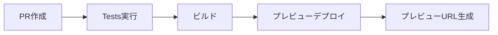
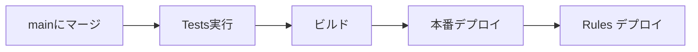

# GitHub Actions セットアップガイド

## 概要

GitHub Actionsを使用して、Firebaseへの自動デプロイを設定します。

## 必要なシークレット

GitHubリポジトリの **Settings → Secrets and variables → Actions** で以下のシークレットを追加してください。

### 1. Firebase環境変数

| シークレット名 | 説明 | 取得方法 |
|---------------|------|----------|
| `FIREBASE_API_KEY` | Firebase API キー | Firebase Console → プロジェクト設定 |
| `FIREBASE_AUTH_DOMAIN` | 認証ドメイン | Firebase Console → プロジェクト設定 |
| `FIREBASE_PROJECT_ID` | プロジェクトID | Firebase Console → プロジェクト設定 |
| `FIREBASE_STORAGE_BUCKET` | Storageバケット | Firebase Console → プロジェクト設定 |
| `FIREBASE_MESSAGING_SENDER_ID` | Messaging Sender ID | Firebase Console → プロジェクト設定 |
| `FIREBASE_APP_ID` | App ID | Firebase Console → プロジェクト設定 |

### 2. Firebase デプロイ用トークン

#### FIREBASE_TOKEN の取得方法

```bash
# Firebase CLI にログイン
firebase login

# CI用のトークンを生成
firebase login:ci
```

生成されたトークンをコピーして、GitHubの `FIREBASE_TOKEN` シークレットに追加します。

#### FIREBASE_SERVICE_ACCOUNT の取得方法

1. [Firebase Console](https://console.firebase.google.com/) でプロジェクトを開く
2. ⚙️ → プロジェクトの設定 → サービスアカウント
3. 「新しい秘密鍵の生成」をクリック
4. ダウンロードされたJSONファイルの内容を**すべて**コピー
5. GitHubの `FIREBASE_SERVICE_ACCOUNT` シークレットに貼り付け

**注意**: JSONファイル全体をそのまま貼り付けてください（改行含む）

## ワークフローの説明

### 1. firebase-hosting-deploy.yml

**トリガー**:
- `main`ブランチへのプッシュ → 本番デプロイ
- プルリクエスト → プレビューデプロイ

**ジョブ**:
1. **test**: テスト・ビルド実行
2. **deploy-preview**: プレビュー環境へデプロイ（PR時）
3. **deploy-production**: 本番環境へデプロイ（main時）

### 2. firebase-rules-deploy.yml

**トリガー**:
- Security Rulesファイルの変更時
- 手動実行

**ジョブ**:
- Firestore Rules のデプロイ
- Firestore Indexes のデプロイ
- Storage Rules のデプロイ

## デプロイフロー

### プルリクエスト作成時



1. プルリクエストを作成
2. 自動でテスト・ビルドが実行
3. プレビュー環境にデプロイ
4. PRにプレビューURLがコメントされる（7日間有効）

### mainブランチへのマージ時



1. mainブランチにマージ
2. 自動でテスト・ビルドが実行
3. 本番環境にデプロイ
4. Security Rules も同時にデプロイ

## セットアップ手順

### ステップ1: リポジトリにシークレットを追加

1. GitHubリポジトリを開く
2. **Settings** → **Secrets and variables** → **Actions**
3. **New repository secret** をクリック
4. 以下のシークレットを1つずつ追加:
   - `FIREBASE_API_KEY`
   - `FIREBASE_AUTH_DOMAIN`
   - `FIREBASE_PROJECT_ID`
   - `FIREBASE_STORAGE_BUCKET`
   - `FIREBASE_MESSAGING_SENDER_ID`
   - `FIREBASE_APP_ID`
   - `FIREBASE_TOKEN`
   - `FIREBASE_SERVICE_ACCOUNT`

### ステップ2: .firebaserc を更新

プロジェクトIDを実際の値に更新してください:

```json
{
  "projects": {
    "default": "your-actual-project-id"
  }
}
```

### ステップ3: 動作確認

1. **ローカルでコミット**:
```bash
git add .
git commit -m "Add GitHub Actions workflows"
git push origin main
```

2. **GitHub Actions タブで確認**:
   - リポジトリの **Actions** タブを開く
   - ワークフローが実行されているか確認

3. **デプロイ成功を確認**:
   - ワークフローが完了したら、Firebase Hosting URLにアクセス
   - アプリが正常に動作しているか確認

### ステップ4: プレビューデプロイをテスト

1. **新しいブランチを作成**:
```bash
git checkout -b feature/test-deploy
```

2. **変更をコミット**:
```bash
git add .
git commit -m "Test deployment"
git push origin feature/test-deploy
```

3. **プルリクエストを作成**:
   - GitHubでプルリクエストを作成
   - GitHub Actionsが自動実行される
   - プレビューURLがPRにコメントされる

## トラブルシューティング

### エラー: "Firebase token is invalid"

**原因**: `FIREBASE_TOKEN` が無効または期限切れ

**解決方法**:
```bash
firebase login:ci
# 新しいトークンを生成してシークレットを更新
```

### エラー: "Service account key is invalid"

**原因**: `FIREBASE_SERVICE_ACCOUNT` が正しくない

**解決方法**:
1. Firebase Console → サービスアカウント
2. 新しい秘密鍵を生成
3. JSONファイル全体をコピーしてシークレットを更新

### エラー: "Build failed"

**原因**: 環境変数が設定されていない

**解決方法**:
1. GitHub Secrets が正しく設定されているか確認
2. シークレット名が正確か確認（スペースや誤字がないか）

### ワークフローが実行されない

**原因**: ワークフローファイルの配置が間違っている

**解決方法**:
1. ファイルパスが `.github/workflows/` であることを確認
2. ファイル拡張子が `.yml` であることを確認

## 手動デプロイ

必要に応じて手動でデプロイすることもできます:

### Hosting のみデプロイ
```bash
npm run build
firebase deploy --only hosting
```

### Rules のみデプロイ
```bash
firebase deploy --only firestore:rules,storage
```

### すべてデプロイ
```bash
npm run build
firebase deploy
```

## ワークフローのカスタマイズ

### Node.js バージョンを変更

`.github/workflows/firebase-hosting-deploy.yml` の以下の部分を変更:

```yaml
- name: Setup Node.js
  uses: actions/setup-node@v4
  with:
    node-version: '22'  # ← ここを変更
```

### デプロイ条件を変更

特定のブランチからのみデプロイする場合:

```yaml
on:
  push:
    branches:
      - main
      - develop  # ← ブランチを追加
```

### プレビューの有効期限を変更

デフォルトは7日間ですが、変更できます:

```yaml
expires: 30d  # 30日間有効
```

## セキュリティベストプラクティス

1. **シークレットは絶対にコードにコミットしない**
2. **最小権限の原則**: 必要な権限のみを付与
3. **定期的なトークン更新**: 3-6ヶ月ごとに更新
4. **ログの確認**: デプロイ後は必ずログを確認

## 参考リンク

- [GitHub Actions Documentation](https://docs.github.com/en/actions)
- [Firebase Hosting GitHub Action](https://github.com/FirebaseExtended/action-hosting-deploy)
- [Firebase CLI Reference](https://firebase.google.com/docs/cli)

## 次のステップ

✅ GitHub Actions が正常に動作したら:
1. プルリクエストでプレビューデプロイをテスト
2. mainブランチにマージして本番デプロイ
3. Firebase Console でアクセス状況を確認
4. モニタリング・アラート設定を検討
